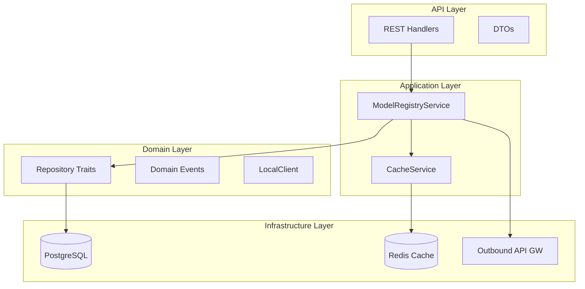
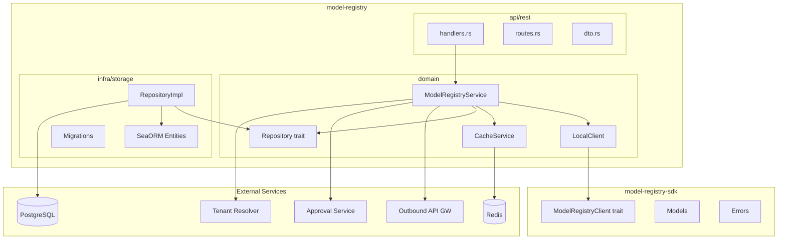
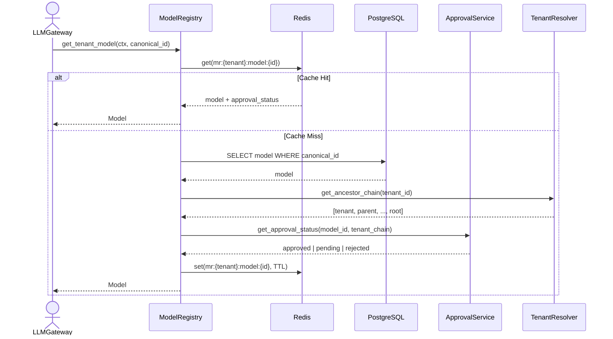
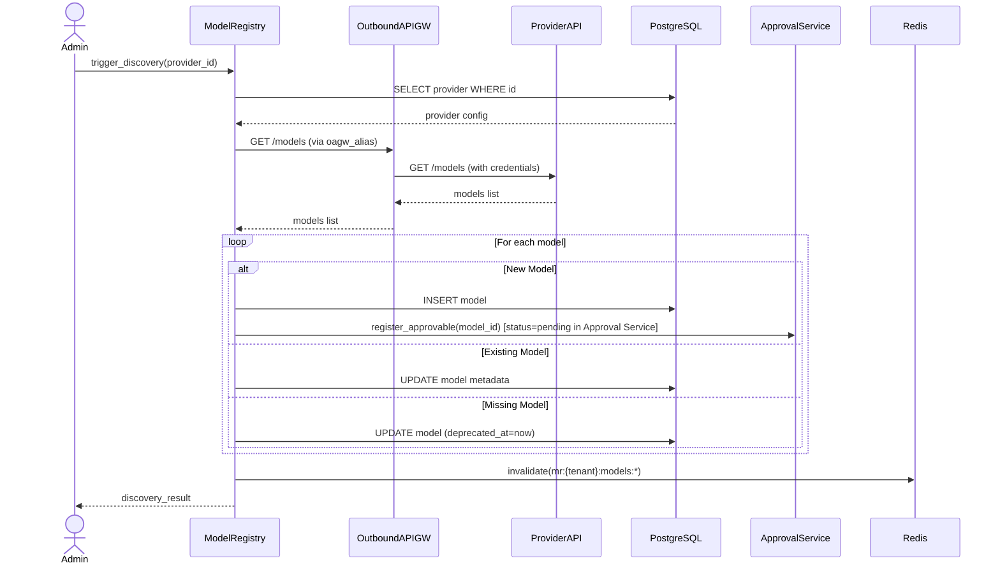
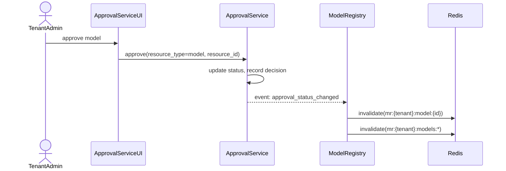
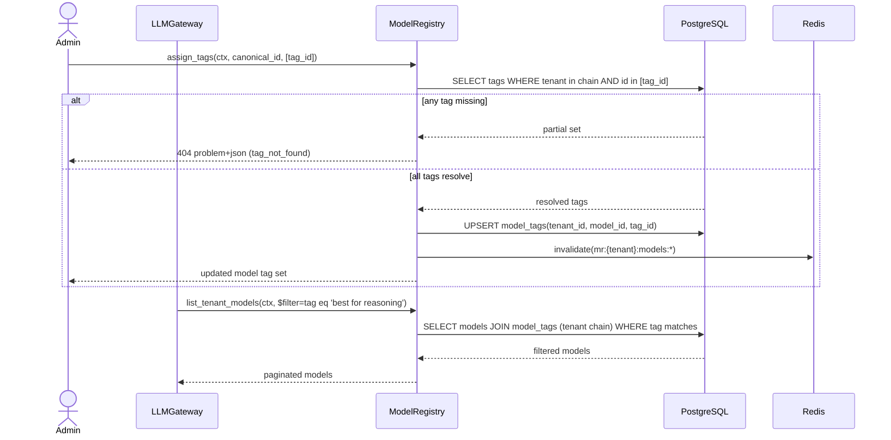
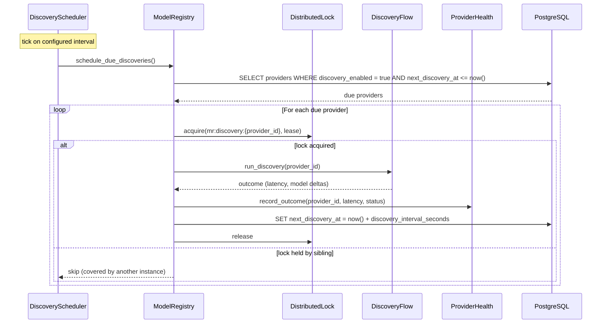

<!-- Updated: 2026-06-23 by Constructor Tech -->

# Technical Design — Model Registry


<!-- toc -->

- [1. Architecture Overview](#1-architecture-overview)
  - [1.1 Architectural Vision](#11-architectural-vision)
  - [1.2 Architecture Drivers](#12-architecture-drivers)
  - [1.3 Architecture Layers](#13-architecture-layers)
- [2. Principles & Constraints](#2-principles--constraints)
  - [2.1 Design Principles](#21-design-principles)
  - [2.2 Constraints](#22-constraints)
- [3. Technical Architecture](#3-technical-architecture)
  - [3.1 Domain Model](#31-domain-model)
  - [3.2 Component Model](#32-component-model)
  - [3.3 API Contracts](#33-api-contracts)
  - [3.4 Internal Dependencies](#34-internal-dependencies)
  - [3.5 Interactions & Sequences](#35-interactions--sequences)
  - [3.6 Database schemas & tables](#36-database-schemas--tables)
- [4. Additional Context](#4-additional-context)
  - [Error Handling](#error-handling)
  - [Cache Invalidation Strategy](#cache-invalidation-strategy)
  - [Security Considerations](#security-considerations)
  - [Data Protection](#data-protection)
  - [Consistency Model](#consistency-model)
  - [Capacity & Cost](#capacity--cost)
  - [Fault Tolerance Policies](#fault-tolerance-policies)
  - [Dependency SLAs](#dependency-slas)
  - [Technical Debt & Roadmap](#technical-debt--roadmap)
  - [Documentation Strategy](#documentation-strategy)
  - [Testing Strategy](#testing-strategy)
  - [Data Governance](#data-governance)
  - [Out of Scope / Not Applicable](#out-of-scope--not-applicable)
- [5. Traceability](#5-traceability)

<!-- /toc -->

## 1. Architecture Overview

### 1.1 Architectural Vision

Model Registry provides a centralized catalog of AI models with tenant-level availability and approval workflows. The service is the authoritative source for model metadata, capabilities, API resolution (provider routing and OAGW alias), default inference parameters, context window limits, cost data, and tenant access control. LLM Gateway queries the registry to resolve model identifiers to provider endpoints and verify tenant access.

The architecture follows the Gears SDK pattern with clear separation between public API surface (`model-registry-sdk`) and implementation (`model-registry`). The system is optimized for high read throughput (1000:1 read:write ratio) with distributed caching (Redis default, pluggable backend). All provider API calls route through Outbound API Gateway for credential injection and circuit breaking.

The design emphasizes tenant isolation with hierarchical inheritance. Providers and approvals inherit down the tenant tree additively, with child tenants able to shadow inherited providers. Cache isolation ensures tenant data separation with TTL-based invalidation.

### 1.2 Architecture Drivers

#### Functional Drivers

- [ ] `p1` — `cpt-cf-model-registry-fr-tenant-isolation` — Tenant ID prefix in cache keys, query filters enforce tenant scope
- [ ] `p1` — `cpt-cf-model-registry-fr-authorization` — Role-based + GTS-based access control via SecurityContext
- [ ] `p1` — `cpt-cf-model-registry-fr-input-validation` — DTO validation in REST layer, domain validation in service
- [ ] `p1` — `cpt-cf-model-registry-fr-cache-isolation` — Cache key format `mr:{tenant_id}:{entity}:{id}`, TTL strategy
- [ ] `p1` — `cpt-cf-model-registry-fr-get-tenant-model` — Cache-first lookup with DB fallback, approval status check
- [ ] `p1` — `cpt-cf-model-registry-fr-list-tenant-models` — OData pagination with capability/provider filtering
- [ ] `p1` — `cpt-cf-model-registry-fr-manual-model-management` — Admin CRUD on models + direct `ModelApproval` status writes (no Approval Service in P1); same REST surface continues to accept admin calls in P2 but routes through Approval Service
- [ ] `p1` — `cpt-cf-model-registry-fr-provider-management` — CRUD with inheritance/shadowing support
- [ ] `p1` — `cpt-cf-model-registry-fr-model-pricing` — AICredits cost data per tier (sync/batch/cached)
- [ ] `p2` — `cpt-cf-model-registry-fr-model-discovery` — OAGW integration, provider plugin abstraction
- [ ] `p2` — `cpt-cf-model-registry-fr-model-approval` — Approval Service integration, event-driven status sync; replaces P1 admin-direct status writes on the same endpoints
- [ ] `p2` — `cpt-cf-model-registry-fr-bulk-operations` — Batch approval via Approval Service
- [ ] `p2` — `cpt-cf-model-registry-fr-manual-trigger` — Discovery API endpoint, rate-limited (health probe trigger added in P3)
- [ ] `p3` — `cpt-cf-model-registry-fr-auto-approval` — Approval Service criteria schema, rule evaluation delegation
- [ ] `p3` — `cpt-cf-model-registry-fr-health-monitoring` — Health status derived from discovery calls, stored per provider
- [ ] `p3` — `cpt-cf-model-registry-fr-alias-management` — Alias table with tenant hierarchy resolution
- [ ] `p3` — `cpt-cf-model-registry-fr-tag-management` — `tags` table with tenant hierarchy resolution (same inheritance/shadowing model as aliases); managed independently of the model catalog
- [ ] `p3` — `cpt-cf-model-registry-fr-model-tagging` — `model_tags` join table (many-to-many, tenant-scoped); OData `tag` filter via join; cascade removal on tag delete
- [ ] `p3` — `cpt-cf-model-registry-fr-degraded-mode` — Tiered behavior: metadata from cache, approval check fails
- [ ] `p3` — `cpt-cf-model-registry-fr-tenant-reparenting` — Cache invalidation on `tenant.reparented` event
- [ ] `p4` — `cpt-cf-model-registry-fr-user-group-approval` — Group-scoped approval restriction layer
- [ ] `p4` — `cpt-cf-model-registry-fr-user-level-override` — User-level override takes precedence over group/tenant

#### NFR Allocation

| NFR ID | NFR Summary | Allocated To | Design Response | Verification Approach |
|--------|-------------|--------------|-----------------|----------------------|
| `cpt-cf-model-registry-nfr-performance` | get_tenant_model <10ms P99 | Cache Layer + Repository | Distributed cache (Redis) with 30min TTL for own data, 5min for inherited | Performance benchmarks measure P99 latency |
| `cpt-cf-model-registry-nfr-availability` | 99.9% uptime | Service + Cache | Stateless design, cache fallback to DB, fail-closed for approval checks | Availability monitoring, SLO dashboards |
| `cpt-cf-model-registry-nfr-scale` | 10K tenants, 2M models | Repository + Cache | Cache isolation by tenant, indexed queries, connection pooling | Load testing at scale targets |
| `cpt-cf-model-registry-nfr-rate-limiting` | Admin ops rate limited | API Layer | Rate limit middleware, configurable per-operation limits | Rate limit metrics, 429 response monitoring |

**Error budgets & alerting thresholds**: Availability NFR `99.9%` translates to a 30-day error budget of ~43 minutes of downtime per month; latency NFR `<10ms P99 on get_tenant_model` is alerted on a 5-minute rolling window above `15ms` (warn) / `25ms` (page). The discovery path is excluded from the user-facing latency SLO — its budget is `next_discovery_at` slip > 2× `discovery_interval_seconds` for any provider. Module-level alerting routes to the platform observability stack (see §4 Out of Scope "Observability") so dashboards/alerts/runbooks live alongside the platform's other modules.

#### Architecture Decisions

The following ADRs capture the load-bearing decisions that shape this design. Each ADR is referenced from the principle or constraint it materializes (see §2).

| ADR ID | Decision | Materialized By |
|--------|----------|-----------------|
| `cpt-cf-model-registry-adr-pluggable-cache` | Pluggable distributed cache (Redis default, InMemory for testing) with TTL-based invalidation | `cpt-cf-model-registry-principle-cache-first` |
| `cpt-cf-model-registry-adr-tenant-inheritance` | Additive provider/approval inheritance with child-shadowing semantics | `cpt-cf-model-registry-principle-additive-inheritance` |
| `cpt-cf-model-registry-adr-approval-delegation` | Delegate approval workflow (state machine, notifications, audit) to generic Approval Service | `cpt-cf-model-registry-principle-approval-delegation` |
| `cpt-cf-model-registry-adr-oagw-provider-access` | All provider API calls route through Outbound API Gateway (no direct provider calls) | `cpt-cf-model-registry-constraint-oagw-dependency` |
| `cpt-cf-model-registry-adr-gts-typed-provider-settings` | GTS-typed provider settings: `ModelInfoV1<P: GtsSchema = serde_json::Value>` envelope with per-provider GTS leaves; `info.gts_type` is the canonical discriminator for storage and the SDK | `cpt-cf-model-registry-component-sdk` |

### 1.3 Architecture Layers



| Layer | Responsibility | Technology |
|-------|---------------|------------|
| API | Request/response handling, validation, OData parsing | REST/OpenAPI, Axum handlers |
| Application | Business logic orchestration, cache management | Domain service, cache service |
| Domain | Repository traits, domain events, SDK client impl | Rust traits, async-trait |
| Infrastructure | Data persistence, caching, external calls | PostgreSQL, Redis, OAGW |

## 2. Principles & Constraints

### 2.1 Design Principles

#### Tenant Isolation

**ID**: `cpt-cf-model-registry-principle-tenant-isolation`

All operations are scoped by tenant context. Cache keys include tenant ID prefix. Query filters enforce tenant hierarchy visibility. Write operations validate tenant ownership. Admin operations verify actor role for target tenant.

#### Cache-First Reads

**ID**: `cpt-cf-model-registry-principle-cache-first`

Read operations check distributed cache before database. Cache misses populate cache from DB. TTL-based expiry prevents stale data accumulation. Own data uses 30-minute TTL; inherited data uses 5-minute TTL for faster propagation of parent changes. Cache backend is pluggable (Redis default, InMemory for testing, custom plugins supported).

#### Additive Inheritance

**ID**: `cpt-cf-model-registry-principle-additive-inheritance`

Providers and approvals inherit down the tenant hierarchy additively. Child tenants see parent's providers plus their own. Child tenants can shadow inherited providers by creating a provider with the same slug. Child tenants cannot expand beyond parent's permissions.

#### Approval Service Delegation

**ID**: `cpt-cf-model-registry-principle-approval-delegation`

Model Registry does not implement approval workflow logic. It delegates to a generic Approval Service that handles state machine, concurrency control, and audit trail. Model Registry registers models as approvable resources and reacts to approval status change events.

#### Conflict Ordering

When two principles produce conflicting guidance, resolve in this order: **tenant-isolation > approval-delegation > additive-inheritance > cache-first**. Tenant isolation is non-negotiable; approval delegation overrides inheritance when an Approval Service decision is authoritative; additive inheritance overrides cache-first when an inherited row must be re-fetched after an invalidation event.

### 2.2 Constraints

#### Outbound API Gateway Dependency

**ID**: `cpt-cf-model-registry-constraint-oagw-dependency`

All provider API calls for model discovery must route through Outbound API Gateway. OAGW handles credential injection, circuit breaking, and outbound URL policy enforcement. Direct provider calls are not permitted.

#### No Credential Storage

**ID**: `cpt-cf-model-registry-constraint-no-credentials`

Model Registry does not store provider credentials. Provider configuration includes slug, name, GTS type, OAGW alias, and discovery settings. All provider access routes through OAGW upstreams referenced by `oagw_alias`. Credential management is OAGW responsibility.

#### Approval Service Integration

**ID**: `cpt-cf-model-registry-constraint-approval-service`

Approval workflow (state machine, notifications, audit) is handled by generic Approval Service. Model Registry provides model-specific criteria schema for auto-approval rules. This constraint ensures consistent approval patterns across the platform.

#### Immutable Provider Slugs

**ID**: `cpt-cf-model-registry-constraint-immutable-slugs`

Provider slugs are immutable after creation. Changing a slug would invalidate all canonical model IDs referencing that provider. Slug format: 1-64 chars, lowercase alphanumeric + hyphen, unique within tenant.

#### Content Logging Restrictions

**ID**: `cpt-cf-model-registry-constraint-content-logging`

Provider cost data and model capabilities are not PII, but discovery responses may contain sensitive provider information. Logging includes only metadata (tenant, provider slug, model count, latency).

#### Constraint Applicability — Not Applicable

The constraint families below are explicitly **not applicable** to Model Registry v1. They are recorded here so reviewers can distinguish "considered and excluded" from "forgotten":

- **Regulatory constraints**: Not applicable in v1 — Model Registry stores model metadata, provider routing, and approval status, but no PII, PHI, PCI, or other regulated data. Revisit when EU/HIPAA/FedRAMP tenants onboard or if discovery surfaces start carrying regulated content.
- **Vendor / licensing constraints**: Not applicable — all shipped dependencies (`SeaORM`, `Redis`, `axum`, `gts`, `gts-macros`, `tokio`, `serde`) are MIT/Apache-2.0 dual-licensed. No proprietary, copyleft, or restrictive components are introduced; no vendor exclusivity clauses apply.
- **Data-residency constraints**: Not applicable at the Model Registry layer. Storage residency is delegated to the platform's chosen PostgreSQL deployment; the registry does not pin a region. Tenant-level residency policy, when introduced, will live at the platform deployment layer rather than inside this module.
- **Resource constraints (budget / team / time)**: Not applicable as architectural constraints. Resource planning is owned by program management and is not a property the design encodes; engineering capacity for the v1 scope is tracked outside this document.
- **Legacy-integration constraints**: Not applicable — Model Registry is a new module with no legacy database, no migration from a prior catalog, and no backward-compatibility commitment to a pre-existing Model Registry contract. The pre-GTS `AnyProviderSettings` / `ProviderKind` carrier was removed in the same change set as this design (see [`cpt-cf-model-registry-adr-gts-typed-provider-settings`](./ADR/0005-cpt-cf-model-registry-adr-gts-typed-provider-settings.md)) and never shipped to production.

## 3. Technical Architecture

### 3.1 Domain Model

**Technology**: Rust structs (SDK models)

**Location**: [`model-registry-sdk/src/models/`](../model-registry-sdk/src/models/) — split per concern into `common.rs`, `info.rs`, `entity.rs`, `provider_settings.rs`, `default_parameters.rs` (the unified `DefaultInferenceParametersV1` and its supporting types — `TextFormat`/`TextFormatKind`/`TextVerbosity`, `ReasoningConfig`/`ReasoningSummary`, `ToolChoice`, `TruncationStrategy`), `request.rs`, plus a `providers/` subdirectory with one file per shipped provider (current shipped set: `openai.rs`, `anthropic.rs`; the directory is the documented extension point — adding a new provider doesn't require touching anything else). The narrowed `ServiceTier` (`Auto | Default`) stays in `common.rs`; provider-specific helper enums (e.g. the five-variant `OpenAiServiceTier`) live next to their provider's file.

**Core Entities**:

| Entity | Description | Priority |
|--------|-------------|----------|
| Provider | Configured AI provider instance for a tenant | P1 |
| Model | AI model in the catalog with capabilities and cost | P1 |
| ModelApproval | Tenant approval status for a model (P1: admin-managed; P2 onward: via Approval Service) | P1 |
| AutoApprovalRule | Rules for automatic model approval | P3 |
| ProviderHealth | Provider discovery health status | P3 |
| Alias | Human-friendly name mapping to canonical ID | P3 |
| Tag | Free-form label associated with models; managed independently of the catalog | P3 |

**Relationships**:
- Model → Provider: Many-to-one (model belongs to provider via provider_id)
- Provider → Tenant: Many-to-one (provider owned by tenant)
- ModelApproval → Model: Many-to-one (approval for specific model in tenant context)
- Alias → Model: Many-to-one (alias points to canonical model ID)
- Tag → Tenant: Many-to-one (tag owned by tenant; inherits down the hierarchy)
- Model ↔ Tag: Many-to-many, tenant-scoped (resolved via the `model_tags` join table; a model carries multiple tags, a tag applies to multiple models). Tags are **not** part of the `ModelInfoV1` JSONB envelope — they are relational, tenant-scoped, and managed on their own surface, so they never travel as provider-supplied metadata.

**Key Domain Types**:

```
CanonicalModelId = "{provider_slug}::{provider_model_id}"
ProviderSlug = 1-64 chars, lowercase alphanumeric + hyphen
LifecycleStatus = production | preview | experimental | deprecated | sunset
ApprovalStatus = pending | approved | rejected | revoked
ProviderHealthStatus = healthy | degraded | unhealthy
SupportedApi = completion | embedding | batch
ReasoningEffort = none | low | medium | high | xhigh             (unified, on default_parameters.reasoning.effort)
ReasoningSummary = concise | detailed | auto
ServiceTier = auto | default                                     (unified, on default_parameters)
OpenAiReasoningEffort = none | minimal | low | medium | high | xhigh  (provider-wire, on OpenAiSettingsV1; `minimal` is OpenAI-specific)
OpenAiServiceTier = auto | default | flex | scale | priority     (provider-wire, on OpenAiSettingsV1; `scale` added)
OpenAiPromptCacheRetention = in_memory | twenty_four_hours       (provider-wire, on OpenAiSettingsV1)
OpenAiEmbeddingEncoding = float | base64                         (provider-wire, on OpenAiSettingsV1)
AnthropicServiceTier = auto | standard_only                      (provider-wire, on AnthropicSettingsV1)
AnthropicOutputEffort = low | medium | high | xhigh | max        (provider-wire, on AnthropicSettingsV1)
AnthropicThinkingDisplay = summarized | omitted                  (provider-wire, on AnthropicSettingsV1.thinking)
TruncationStrategy = auto | disabled
TextFormatKind = text | json_object | json_schema
TextVerbosity = low | medium | high
ToolChoice = auto | required | none | function{name}
GtsSchemaId (ModelInfoV1 chain — extensible; the providers shipped in the SDK today are listed below):
    gts.cf.genai.model.info.v1~                              (base envelope)
    gts.cf.genai.model.info.v1~cf.genai._.openai.v1~         (OpenAI leaf)
    gts.cf.genai.model.info.v1~cf.genai._.anthropic.v1~      (Anthropic leaf)
```

**`ModelInfoV1<P>`** is a [GTS-schema-typed](https://docs.rs/gts) struct generic over a provider settings payload `P: gts::GtsSchema`. It carries only the fields that are meaningful for **every** provider — display metadata, capabilities, the context window, performance, the GTS schema id (`gts_type`), a small slice of identity (`supported_api`, `provider_model_id`) that consumers (catalog UI, alias resolution, OData filtering) need without having to deserialize the variant payload, the **user-facing** default inference parameters (`default_parameters`), and the per-request override policy (`overrides`). Everything else (routing/auth, **provider-wire** default parameters, token pricing) lives in the `provider_settings: P` payload — one typed struct per provider, identified at runtime via `gts_type`.

The split between `default_parameters` (on the envelope) and per-provider parameter fields (on `provider_settings`) is deliberate: the former mirrors the **client-facing** Open Responses request schema ([`gts.cf.llmgw.core.create_response_body.v1~`](../../llm-gateway/llm-gateway-sdk/schemas/core/create_response_body.v1.schema.json)) so the gateway has a uniform input contract; the latter captures the **provider-wire** defaults that ride alongside (different naming, mutually-exclusive variants, provider-only knobs). Field names that look universal — e.g. `temperature`, `top_p`, `max_output_tokens` — are intentionally duplicated across the two surfaces because they are rarely 1:1 in practice (e.g. OpenAI legacy `max_tokens` vs Responses `max_completion_tokens`; some providers require it on every request and reject defaults set elsewhere). The gateway merges request → `default_parameters` → per-provider defaults at send time.

Common (provider-independent) fields:

- **gts_type** (`gts::GtsSchemaId`) — full GTS schema chain identifying this model's settings shape (e.g. `gts.cf.genai.model.info.v1~cf.genai._.openai.v1~`). Mirrors `Provider.gts_type` and is the **canonical key for resolving** the concrete shape of `provider_settings` at runtime
- **display_name** (`String`) — display name shown in UI
- **description** (`Option<String>`) — model description
- **family** (`Option<String>`) — model family (e.g. `"gpt-4"`, `"claude"`, `"llama"`)
- **vendor** (`Option<String>`) — organization that produced the model weights (e.g. `"OpenAI"`, `"Meta"`); free-form string, independent of which provider serves the model
- **managed** (`bool`) — infrastructure field for local/managed LLMs: whether Gears can load/unload **this model** (e.g. install/pull/unload weights on a local runtime such as Ollama or LM Studio). This is a **per-model** flag and is distinct from the **per-provider** `Provider.managed` flag (§3.6 `providers` table), which records whether Gears can manage the *provider* at all; a model can only be `managed` when its provider is also managed. Defaults to `false` (e.g. for API-only models). Lives on the common envelope (not `provider_settings`) so the catalog UI and OData `$filter` can read it without narrowing the provider variant
- **architecture** (`Option<String>`) — infrastructure field for local/managed LLMs: model architecture classifier (e.g. `"qwen"`, `"llama"`, `"mistral"`, `"gpt"`). Distinct from the free-form `family`/`vendor` labels above, which are descriptive marketing/origin labels rather than an architecture taxonomy
- **size_bytes** (`Option<u64>`) — infrastructure field for local/managed LLMs: on-disk model size in bytes, used for capacity planning of local/managed weights; `None` for models whose weights are not locally hosted (e.g. API-only)
- **format** (`Option<String>`) — infrastructure field for local/managed LLMs: model weight/serving format (e.g. `"gguf"`, `"mlx"`, `"safetensors"`, `"api-only"`)
- **region** (`Option<String>`) — deployment region (e.g. `"us-east-1"`, `"eu-west-1"`)
- **hosted_by** (`Option<String>`) — infrastructure host (e.g. `"Azure"`, `"AWS Bedrock"`, `"self-hosted"`)
- **last_release_at** (`Option<DateTime>`) — when the model version was last released by the vendor
- **reasoning_level** (`Option<String>`) — informational reasoning level label, display-only
- **version** (`Option<String>`) — model version string
- **sort_order** (`Option<i32>`) — display order in model picker / lists
- **icon** (`Option<String>`) — URL to model icon
- **multiplier_display** (`Option<String>`) — human-readable cost multiplier label (e.g. `"1x"`, `"3x"`)
- **performance** (`ModelPerformance`) — estimated performance characteristics
  - **response_latency_ms** (`Option<u32>`) — expected response latency in milliseconds
  - **tokens_per_second** (`Option<u32>`) — expected generation speed
- **additional_info** (`HashMap<String, Value>`) — last-resort escape hatch for deployment-specific metadata; typed fields on `provider_settings` are preferred
- **supported_api** (`HashSet<SupportedApi>`) — which API kinds this model exposes (`completion`, `embedding`, `batch`). `batch` indicates the model is reachable via the asynchronous batch API (see `gts.cf.llmgw.async.batch.v1~`) and may coexist with `completion` / `embedding` on the same model. Promoted out of the old `ApiResolution` so consumers can filter on the API surface without unwrapping the variant
- **provider_model_id** (`String`) — provider's model identifier, used in `canonical_id` and sent to the provider; promoted out of the old `ApiResolution` so the catalog UI / alias logic doesn't have to reach into `provider_settings`
- **capabilities** (`ModelCapabilities`) — what the model can do
  - **vision** (`MediaCapability`) — supports image/vision input
    - **enabled** (`bool`) — vision capability is available
    - **supported_mime_types** (`Vec<String>`) — accepted image media types (e.g. `image/png`, `image/jpeg`, `image/webp`, `image/heic`)
  - **reasoning** (`ReasoningCapability`) — reasoning controls
    - **effort** (`bool`) — supports `reasoning_effort` parameter
    - **toggle** (`bool`) — supports toggling reasoning on/off
    - **resume** (`bool`) — supports resuming a reasoning chain
    - **budget** (`bool`) — supports explicit reasoning token budget
  - **function_calling** (`bool`) — supports function/tool calling
  - **response_schema** (`bool`) — supports structured output via JSON schema
  - **streaming** (`bool`) — supports streaming responses
  - **file_input** (`MediaCapability`) — supports file input (PDFs, documents, …). `MediaCapability` is the shared `{ enabled: bool, supported_mime_types: Vec<String> }` shape used by the five media-shaped capabilities (`vision`, `file_input`, `image_generation`, `audio_input`, `audio_output`). MIME types follow [RFC 6838](https://datatracker.ietf.org/doc/html/rfc6838) (lowercased canonical spelling, e.g. `audio/mpeg`, not `audio/MP3`)
    - **enabled** (`bool`) — file-input capability is available
    - **supported_mime_types** (`Vec<String>`) — media types the model accepts as file input (e.g. `application/pdf`, `text/plain`, `application/json`). Empty `Vec` when `enabled` is `false`, or when the provider doesn't surface a per-type list
  - **image_generation** (`MediaCapability`) — can generate images
    - **enabled** (`bool`) — image-generation capability is available
    - **supported_mime_types** (`Vec<String>`) — RFC 6838 media types the model produces (e.g. `image/png`, `image/jpeg`, `image/webp`)
  - **audio_input** (`MediaCapability`) — accepts audio input (speech-to-text, audio understanding)
    - **enabled** (`bool`) — audio-input capability is available
    - **supported_mime_types** (`Vec<String>`) — accepted audio media types (e.g. `audio/mpeg`, `audio/wav`, `audio/webm`, `audio/ogg`)
  - **audio_output** (`MediaCapability`) — produces audio output (text-to-speech)
    - **enabled** (`bool`) — audio-output capability is available
    - **supported_mime_types** (`Vec<String>`) — produced audio media types (e.g. `audio/mpeg`, `audio/wav`, `audio/opus`)
  - **code_interpreter** (`bool`) — supports sandboxed code execution
  - **web_search** (`WebSearchCapability`) — web search capability
    - **enabled** (`bool`) — web search is available
    - **allowed_domains** (`bool`) — supports configuring an allow-list of domains to restrict search to
    - **excluded_domains** (`bool`) — supports configuring a deny-list of domains to exclude from search
- **disabled_capabilities** (`DisabledCapabilities`) — capabilities that are administratively disabled for this model. Distinct nominal type from `capabilities` (so the two can never be assigned interchangeably) with parallel field names whose booleans all read as **"disabled"**:
  - **vision** (`DisabledMediaCapability`) — image/vision input disabled
    - **disabled** (`bool`) — the whole capability is disabled
    - **disabled_mime_types** (`Vec<String>`) — RFC 6838 names removed from the supported set
  - **reasoning** (`DisabledReasoningCapability`)
    - **effort** (`bool`) — the `reasoning_effort` parameter is disabled
    - **toggle** (`bool`) — reasoning toggle is disabled
    - **resume** (`bool`) — resume / continue reasoning is disabled
    - **budget** (`bool`) — reasoning token budget is disabled
  - **function_calling** (`bool`) — function/tool calling is disabled
  - **response_schema** (`bool`) — schema-bound output is disabled
  - **streaming** (`bool`) — streaming is disabled
  - **file_input** (`DisabledMediaCapability`) — file input disabled (same shape as `vision`)
  - **image_generation** (`DisabledMediaCapability`) — image generation disabled. Example: `capabilities.image_generation.supported_mime_types = ["image/png", "image/svg+xml"]` together with `disabled_capabilities.image_generation.disabled_mime_types = ["image/svg+xml"]` means "the model supports both PNG and SVG, but the admin has disabled SVG"
  - **audio_input** (`DisabledMediaCapability`) — audio input disabled
  - **audio_output** (`DisabledMediaCapability`) — audio output disabled
  - **code_interpreter** (`bool`) — code interpreter is disabled
  - **web_search** (`DisabledWebSearchCapability`)
    - **disabled** (`bool`) — web search is disabled outright
    - **allowed_domains** (`bool`) — configuring the allow-list is disabled
    - **excluded_domains** (`bool`) — configuring the deny-list is disabled
- **context_window** (`ContextWindow`) — token limits
  - **max_input_tokens** (`u32`) — maximum input tokens
  - **max_output_tokens** (`Option<u32>`) — maximum output tokens; `None` for embedding models
  - **output_vector_size** (`Option<u32>`) — output vector dimensionality for embedding models
- **default_parameters** (`DefaultInferenceParametersV1`) — universal **user-facing** default inference parameters; mirrors the inference-knob subset of the Open Responses request schema (`gts.cf.llmgw.core.create_response_body.v1~`)
  - **temperature** (`Option<f64>`) — sampling temperature (no min/max constraints — providers differ)
  - **top_p** (`Option<f64>`) — nucleus sampling
  - **max_output_tokens** (`Option<u32>`) — maximum output tokens
  - **max_tool_calls** (`Option<u32>`) — maximum number of tool calls per response
  - **presence_penalty** (`Option<f64>`)
  - **frequency_penalty** (`Option<f64>`)
  - **top_logprobs** (`Option<u8>`) — top log-probabilities to return per token
  - **truncation** (`Option<TruncationStrategy>`) — `Auto | Disabled`; context truncation strategy
  - **service_tier** (`Option<ServiceTier>`) — `Auto | Default`; matches the Open Responses two-variant shape (provider-specific tiers like OpenAI `flex`/`priority` are expressed only at request time via the override-extras allowlist)
  - **parallel_tool_calls** (`Option<bool>`) — whether the model may issue multiple tool calls in parallel
  - **text** (`Option<TextFormat>`) — response text format configuration
    - **format** (`TextFormatKind`) — `Text | JsonObject | JsonSchema { name: String, description: Option<String>, schema: Option<Value>, strict: bool }`
    - **verbosity** (`Option<TextVerbosity>`) — `Low | Medium | High`
  - **reasoning** (`Option<ReasoningConfig>`) — reasoning controls
    - **effort** (`Option<ReasoningEffort>`) — existing `common.rs` enum (`None | Low | Medium | High | XHigh`)
    - **summary** (`Option<ReasoningSummary>`) — `Concise | Detailed | Auto` (new; matches `gts.cf.llmgw.core.reasoning_config.v1~`)
  - **tool_choice** (`Option<ToolChoice>`) — `Auto | Required | None | Function { name: String }` (matches the create_response_body `tool_choice` shape)
  - **store** (`Option<bool>`) — whether to store the response for later retrieval
- **allow_parameter_override** (`bool`) — whether callers may override `default_parameters` per-request. Flat field on the envelope (no `ParameterOverridePolicy` wrapper struct)
- **allow_extra_params** (`Vec<String>`) — which extra (non-default) parameter names callers may pass alongside the request. Flat field on the envelope
- **provider_settings** (`P: gts::GtsSchema`) — provider-specific connection routing, **provider-wire** default parameters, and token pricing. The default `P = serde_json::Value` (which implements `gts::GtsSchema` upstream in the `gts` crate); typed views (e.g. `OpenAiSettingsV1`, `AnthropicSettingsV1`; the shipped set is open-ended and lives in `models/providers/`) plug in here once the consumer has narrowed via `gts_type`. **Not** present in the published JSON schema for the base envelope (the per-provider shape is published instead in each leaf's schema — see "Provider Settings" below)

`Model<P: gts::GtsSchema = serde_json::Value>` carries `info: ModelInfoV1<P>`. The [`ModelRegistryClientV1`](../model-registry-sdk/src/api.rs) trait returns the default `Model` (i.e. `Model<serde_json::Value>`) on its public surface — the provider settings ride as opaque JSON until the consumer narrows. Narrowing is by GTS schema id: `Model::try_into_typed::<OpenAiSettingsV1>()` is a thin wrapper over `gts::try_narrow` that checks `info.gts_type` against `OpenAiSettingsV1::TYPE_ID` and deserializes the JSON payload into the typed shape, returning `Result<Model<OpenAiSettingsV1>, gts::NarrowError>`.

#### Provider Settings Trait & Default Carrier

The SDK layer exposes one building block for typed-narrowing — the `ProviderSettings` marker trait — and reuses the default carrier and narrowing error from the upstream `gts` crate. See [`model-registry-sdk/src/models/`](../model-registry-sdk/src/models/) for the concrete declarations:

- **`ProviderSettings`** is the marker trait every typed per-provider settings leaf implements. It carries no required methods; its bounds are the standard SDK domain-model bounds (`Debug + Clone + PartialEq + Send + Sync + 'static`) plus `gts::GtsSchema`, so every leaf publishes a GTS schema id. One struct exists per provider, versioned independently — the current generation uses the `V1` suffix and future generations may coexist as `V2`, `V3`, …
- **`serde_json::Value`** is the default `P` on `ModelInfoV1` / `Model`. It implements `gts::GtsSchema` upstream in the `gts` crate (no hand-written newtype carrier in this SDK) and rides as a bare JSON value over the wire. Consumers see this shape before they have narrowed to a typed leaf.
- **`gts::NarrowError`** is the error returned by `Model::try_into_typed` (via `gts::try_narrow`). It distinguishes a `SchemaId` mismatch (expected vs actual GTS id, both surfaced as strings) from a `Deserialize` failure (a wrapped `serde_json::Error` while shaping the JSON payload into the typed struct).

The override policy is **not** part of the per-provider settings — and is **not** a struct: `allow_parameter_override` (`bool`) and `allow_extra_params` (`Vec<String>`) are flat fields on `ModelInfoV1`, applied uniformly to a model regardless of provider variant.

There is **no** tagged enum mirroring the shipped providers. The provider family is identified solely by `info.gts_type` (a `gts::GtsSchemaId` whose value is the leaf schema id of one of the providers shipped in the SDK — or any other GTS id an operator chooses to use). Forward compat for unknown providers is automatic: a model with a `gts_type` the SDK doesn't recognize still carries its `provider_settings` as raw JSON (`serde_json::Value`), and operators can wire up routing without an SDK release.

#### Provider-specific settings (flat composition with nested `cost`)

Each per-provider settings struct is **flat** — earlier `*Connection` and `*Parameters` sub-structs are removed; their fields move directly onto the aggregate. Only `cost` remains nested (its shape varies meaningfully across providers and is not request-time data). The override fields (`allow_parameter_override`, `allow_extra_params`) are not duplicated here — they live as flat fields on `ModelInfoV1`.

Per-provider settings types are versioned independently from the envelope. The current generation uses the `V1` suffix; a future revision of any one provider can ship alongside (e.g. `OpenAiSettingsV2`) with its own GTS schema id, and consumers narrow to whichever generation matches `info.gts_type`. The discussion that follows refers to "the per-provider settings struct" generically.

The set of per-provider settings types shipped in the SDK is **open-ended** — only the providers documented in this section ship today, and additional providers can be added in `models/providers/` without touching anything else. Each provider's section below covers its current shipped shape.

Per-provider parameter fields capture the **provider-wire** defaults: the gateway sends them to the provider after merging with the user's request and `default_parameters`. They intentionally retain provider-specific naming (e.g. OpenAI's legacy `max_tokens` vs Responses-API `max_completion_tokens`) because those names are not 1:1 with the unified `default_parameters` and the gateway must distinguish them. Field names that are spelled the same as `default_parameters` fields are still distinct — the per-provider value is the wire-level default; `default_parameters` is the user-facing default.

None of the per-provider settings structs repeats `supported_api` or `provider_model_id` — those live on `ModelInfoV1`.

**`OpenAiSettingsV1`** — for OpenAI Chat Completions, Responses, and Embeddings APIs. GTS leaf id: `gts.cf.genai.model.info.v1~cf.genai._.openai.v1~`. Declared as a GTS schema leaf with `base = ModelInfoV1`. Field set is verified against the OpenAPI spec for `POST /v1/chat/completions`, `POST /v1/responses`, and `POST /v1/embeddings`. Fields that are inherently per-request (input/messages, tools, tool_choice, instructions, metadata, safety_identifier, prompt_cache_key, stream, stream_options, background, include, conversation, modalities, audio, prediction, web_search_options, logit_bias, function_call/functions) are intentionally **not** stored as registry defaults — the gateway builds them per call.

Connection / auth (OpenAI-specific routing):

- **oagw_alias** (`String`) — OAGW upstream alias for credentials and base URL routing
- **endpoint_kind** (`OpenAiEndpoint`) — `ChatCompletions | Responses | Embeddings`
- **organization** (`Option<String>`) — OpenAI organization id
- **project** (`Option<String>`) — OpenAI project id
- **temperature** (`Option<f64>`) — provider-wire sampling temperature; OpenAI accepts 0-2
- **top_p** (`Option<f64>`) — nucleus sampling
- **presence_penalty** (`Option<f64>`) — −2..2
- **frequency_penalty** (`Option<f64>`) — −2..2
- **top_logprobs** (`Option<u8>`) — number of top log-probabilities to return per token (OpenAI accepts 0-20)
- **service_tier** (`Option<OpenAiServiceTier>`) — `Auto | Default | Flex | Scale | Priority` (full OpenAI five-variant tier — `Scale` was missing in earlier revisions; distinct from the unified two-variant `ServiceTier` on `default_parameters`)
- **prompt_cache_retention** (`Option<OpenAiPromptCacheRetention>`) — `InMemory | TwentyFourHours`; controls how long OpenAI keeps cached prefixes alive (default in-memory; set `TwentyFourHours` for extended prompt caching)
- **reasoning_effort** (`Option<OpenAiReasoningEffort>`) — for o-series and gpt-5 reasoning models. Provider-wire enum with six variants (`None | Minimal | Low | Medium | High | XHigh`) — distinct from the unified five-variant `ReasoningEffort` on `default_parameters.reasoning.effort` (the unified shape stays neutral; OpenAI-specific values like `Minimal` live on the per-provider enum, so adding an OpenAI-only level doesn't perturb the shared enum)
- **reasoning_summary** (`Option<ReasoningSummary>`) — Responses-API `reasoning.summary` knob; uses the shared `ReasoningSummary` enum (`Auto | Concise | Detailed`). Replaces the previous loosely-typed `Option<String>`
- **verbosity** (`Option<TextVerbosity>`) — Chat-API top-level `verbosity` and Responses-API `text.verbosity` map to the same shape (`Low | Medium | High`); a single registry field covers both
- **parallel_tool_calls** (`Option<bool>`)
- **response_format** (`Option<OpenAiResponseFormat>`) — `Text | JsonObject | JsonSchema(Value)`. On Chat the wire field is `response_format`; on Responses the equivalent ships via `text.format`
- **n** (`Option<u32>`) — number of completions per request; OpenAI accepts 1-128
- **stop** (`Option<Vec<String>>`) — stop sequences
- **seed** (`Option<u64>`) — deterministic sampling seed. **Marked Beta + deprecated by OpenAI** but still accepted on the wire; kept for callers who need it
- **logprobs** (`Option<bool>`) — return log probabilities of output tokens (Chat-API only; pairs with `top_logprobs`)
- **max_output_tokens** (`Option<u32>`) — Responses-API output cap. OpenAI enforces a minimum of 16 server-side; the SDK does not range-check this value (consistent with the no-min/max policy on sampling parameters)
- **max_tool_calls** (`Option<u32>`) — maximum number of total built-in tool calls per response
- **truncation** (`Option<TruncationStrategy>`) — `Auto | Disabled`; reuses the shared `TruncationStrategy` from `default_parameters`. OpenAI default on the wire is `Disabled`
- **cost** (`OpenAiCost`) — pricing in micro-credits (`u64`, scaled ×1,000,000). Token rates are **per 1K tokens**; built-in-tool rates are **per 1K calls**. Long-context rates apply when input length exceeds `long_context_threshold_tokens` (standard rates apply below)
  - **input_per_1k_micro** (`Option<u64>`)
  - **cached_input_per_1k_micro** (`Option<u64>`)
  - **output_per_1k_micro** (`Option<u64>`)
  - **long_context_input_per_1k_micro** (`Option<u64>`) — input rate when above the threshold
  - **long_context_cached_input_per_1k_micro** (`Option<u64>`) — cached-input rate when above the threshold
  - **long_context_output_per_1k_micro** (`Option<u64>`) — output rate when above the threshold
  - **long_context_threshold_tokens** (`Option<u32>`) — input-token boundary above which the long-context rates apply
  - **web_search_per_1k_calls_micro** (`Option<u64>`) — built-in web-search tool charge per 1,000 invocations
  - **file_search_per_1k_calls_micro** (`Option<u64>`) — built-in file-search tool charge per 1,000 invocations

**`AnthropicSettingsV1`** — for the Anthropic Messages API (`POST /v1/messages`). GTS leaf id: `gts.cf.genai.model.info.v1~cf.genai._.anthropic.v1~`. Declared as a GTS schema leaf with `base = ModelInfoV1`. Per-request fields (`messages`, `model`, `tools`, `metadata`, `cache_control`, `stream`) are intentionally **not** stored as registry defaults — the gateway builds them per call.
- **oagw_alias** (`String`) — OAGW upstream alias for credentials and base URL routing
- **anthropic_version** (`String`) — required `anthropic-version` HTTP header value (e.g. `"2023-06-01"`)
- **anthropic_beta** (`Vec<String>`) — `anthropic-beta` flag headers (extended thinking, 1M context, …)
- **temperature** (`Option<f64>`) — Anthropic accepts `0.0..=1.0`; SDK does not range-check
- **top_p** (`Option<f64>`)
- **top_k** (`Option<u32>`)
- **max_tokens** (`u32`) — **required** by Anthropic on every request. The SDK default of `0` is treated as "unset" by callers, forcing them to use max context size
- **stop_sequences** (`Option<Vec<String>>`)
- **system** (`Option<String>`) — default system prompt. The wire surface also accepts a sequence of text blocks; the registry default is the simpler string form, and the gateway may translate to a block sequence per request when needed
- **inference_geo** (`Option<String>`) — geographic region hint for inference processing (e.g. `"us"`, `"eu"`); the workspace's `default_inference_geo` is used when this is unset
- **service_tier** (`Option<AnthropicServiceTier>`) — `Auto | StandardOnly`. `StandardOnly` opts out of priority capacity
- **container** (`Option<String>`) — container identifier for reuse across requests (used by the code-execution / 1M-context tools)
- **thinking** (`Option<AnthropicThinking>`) — extended-thinking config; tagged union with 3 variants (`type` discriminator)
  - **`Enabled`** — `{ budget_tokens: u32, display: Option<AnthropicThinkingDisplay> }`. `budget_tokens` is required on this variant. Anthropic enforces `1024 ≤ budget_tokens < max_tokens` server-side; the SDK does not range-check. **Anthropic flags `type=enabled` as deprecated for newer models — prefer `Adaptive`**
  - **`Disabled`** — no extra fields
  - **`Adaptive`** — `{ display: Option<AnthropicThinkingDisplay> }`. The server adapts the thinking budget; recommended replacement for `Enabled` on newer models
  - `AnthropicThinkingDisplay` — `Summarized | Omitted` (default `Summarized`); controls how thinking content appears in the response
- **tool_choice** (`Option<AnthropicToolChoice>`) — tool-selection policy; tagged union with 4 variants (`type` discriminator)
  - **`Auto`** — `{ disable_parallel_tool_use: Option<bool> }`. Model decides whether to call any tool
  - **`Any`** — `{ disable_parallel_tool_use: Option<bool> }`. Model must call exactly one tool
  - **`Tool`** — `{ name: String, disable_parallel_tool_use: Option<bool> }`. Force a specific tool by name
  - **`None`** — no extra fields. Tool calls are not allowed; `disable_parallel_tool_use` is meaningless here so it's not carried
- **output_config** (`Option<AnthropicOutputConfig>`) — output-shaping config
  - **effort** (`Option<AnthropicOutputEffort>`) — `Low | Medium | High | XHigh | Max`. Anthropic uses this for output-shaping effort, separate from `thinking.budget_tokens`
  - **format** (`Option<AnthropicJsonOutputFormat>`) — structured-output format; `{ schema: serde_json::Value }`. The wire shape is `{type: "json_schema", schema: <JSON Schema>}` — the type tag is set by the serde discriminator on serialization
- **cost** (`AnthropicCost`) — pricing in micro-credits (`u64`, scaled ×1,000,000). Token rates are **per 1K tokens**; built-in-tool rates are **per 1K calls**. Anthropic bills cache writes at separate 5-minute and 1-hour tiers (matching the values accepted by `cache_control.ttl`) and cache reads at a third rate
  - **input_per_1k_micro** (`Option<u64>`)
  - **output_per_1k_micro** (`Option<u64>`)
  - **cache_creation_5m_per_1k_micro** (`Option<u64>`) — matches `cache_control.ttl = "5m"`
  - **cache_creation_1h_per_1k_micro** (`Option<u64>`) — matches `cache_control.ttl = "1h"`
  - **cache_read_per_1k_micro** (`Option<u64>`)
  - **web_search_per_1k_calls_micro** (`Option<u64>`) — built-in web-search tool charge per 1,000 invocations

#### Polymorphism Strategy

The chosen shape is `ModelInfoV1<P: gts::GtsSchema = serde_json::Value>` — a generic GTS-typed envelope with a JSON-shaped default carrier. The discriminator is `info.gts_type: GtsSchemaId`, which is the same schema chain registered via `#[struct_to_gts_schema]` on each leaf and the same string written to the polymorphic JSONB column on disk (see §3.6). Heterogeneous list endpoints ride the default `Model` shape (`P = serde_json::Value`); consumers that have already narrowed to a provider get the typed view via `Model<OpenAiSettingsV1>` etc.

The trade-off comparison against the rejected alternatives — a tagged enum (`AnyProviderSettings`) and a `Box<dyn ProviderSettings>` trait object — together with the decision drivers and consequences lives in the ADR and is intentionally not duplicated here: see [`cpt-cf-model-registry-adr-gts-typed-provider-settings`](./ADR/0005-cpt-cf-model-registry-adr-gts-typed-provider-settings.md).

**Resolving the typed shape at runtime.** The default `Model` (`P = serde_json::Value`) is the public return shape from `ModelRegistryClientV1`. Consumers narrow to a provider by calling `Model::try_into_typed::<P>()`, which delegates to `gts::try_narrow` — checking `info.gts_type == <P>::TYPE_ID` and shaping the JSON payload into the typed view. Field access on the narrowed model is flat — there is no `connection.` / `parameters.` / `overrides.` namespacing; provider-wire defaults sit on `info.provider_settings`, user-facing defaults on `info.default_parameters`, override policy as flat fields on `info`, and only `cost` remains nested under `info.provider_settings.cost`. `try_into_typed` returns `Result<Model<Q>, gts::NarrowError>`; the error carries the expected and actual schema ids on `SchemaId` mismatch, or wraps a `serde_json::Error` on `Deserialize` failure. See [`model-registry-sdk/src/models/entity.rs`](../model-registry-sdk/src/models/entity.rs) for the concrete `try_into_typed` implementation and per-leaf narrowing tests.

> **SDK serde policy.** GTS adoption forces the SDK layer to participate in serde — the `#[struct_to_gts_schema]` macro emits `Serialize`/`Deserialize` impls (via `GtsSerialize`/`GtsDeserialize` for nested leaves) plus `schemars::JsonSchema` derives. Inner field types referenced from the GTS-decorated structs (`*Cost`, `DefaultInferenceParametersV1`, `TextFormat`, `ReasoningConfig`, `ToolChoice`, `TruncationStrategy`, `ModelCapabilities`, `DisabledCapabilities` (and its `DisabledMediaCapability` / `DisabledReasoningCapability` / `DisabledWebSearchCapability` sub-types), `ContextWindow`, …) therefore also derive `serde::Serialize + serde::Deserialize + schemars::JsonSchema`. This is an explicit exception to the project rule "no serde on contract types" — GTS by design needs serde for runtime schema reflection. REST DTO layering still applies for any HTTP-specific shapes (different headers, alternate field names, etc.) in `api/rest/dto.rs`.

#### Invariants

- **Provider slug immutability**: once a provider is created, its `slug` cannot change — changing it would invalidate every `canonical_id = {provider_slug}::{provider_model_id}` referencing it. Enforced at the application layer in the service.
- **Canonical model ID format**: `{provider_slug}::{provider_model_id}` is the only canonical form; aliases resolve to canonical IDs but never to other aliases.
- **`info.gts_type` discriminator immutability**: once a model is created, `gts_type` cannot change without a model replacement — it determines the on-disk shape of `provider_settings` and the typed view consumers narrow to.
- **Approval status not stored on `models`**: `Model::approval_status` is resolved on read from Approval Service per §2.1 "Approval Service Delegation". The discovery write path never writes approval state.
- **Tenant-scoped uniqueness**: `(tenant_id, slug)` is unique per provider, `(tenant_id, canonical_id)` is unique per model, `(tenant_id, name)` is unique per alias, `(tenant_id, lower(name))` is unique per tag (case-insensitive), and `(tenant_id, model_id, tag_id)` is unique per tag assignment.
- **Tag managed independently of models**: a tag's lifecycle (create/update/delete) is decoupled from the catalog; deleting a tag cascades only to its `model_tags` rows within the owning tenant scope and never mutates `models`.
- **Cache-key tenant prefix**: every cache key is prefixed with `mr:{tenant_id}:` — no tenantless keys exist.

### 3.2 Component Model



#### model-registry-sdk

**ID**: `cpt-cf-model-registry-component-sdk`

SDK crate containing public API surface. Transport-agnostic trait, models, and errors. Consumers depend only on this crate.

**Interface**: `ModelRegistryClient` trait with async methods taking `&SecurityContext`.

#### ModelRegistryService

**ID**: `cpt-cf-model-registry-component-service`

Domain service orchestrating business logic. Handles cache management, repository access, OAGW calls for discovery, and Approval Service integration.

**Interface**: Internal domain methods, event emission.

#### LocalClient

**ID**: `cpt-cf-model-registry-component-local-client`

Local client implementing `ModelRegistryClient` trait. Bridges domain service to SDK interface. Registered in ClientHub for in-process consumers.

**Interface**: Implements `ModelRegistryClient` trait.

#### CacheService

**ID**: `cpt-cf-model-registry-component-cache`

Distributed cache abstraction. Handles cache key generation with tenant prefix, TTL management, and invalidation. Backends are compiled-in via Cargo feature flags (not runtime plugins): `RedisCache` (default for production), `InMemoryCache` (for testing and lightweight single-node deployments). Deployments without Redis are supported — the in-memory backend avoids the operational overhead of a separate Redis instance while the database's own query cache provides comparable latency for moderate-scale setups. Redis becomes beneficial at high scale (10K+ tenants, 2M+ models) where cross-instance cache consistency and horizontal scaling matter.

**Interface**: `get`, `set`, `delete`, `invalidate_tenant`.

#### RepositoryImpl

**ID**: `cpt-cf-model-registry-component-repository`

SeaORM-based repository implementation. Handles CRUD operations, tenant-scoped queries, and OData filtering.

**Interface**: Implements `ModelRegistryRepository` trait.

#### Extension Points

The module exposes three deliberate extension points and two API stability zones:

- **Pluggable cache backend** (compile-time): `CacheService` trait with feature-gated implementations (`RedisCache`, `InMemoryCache`). New backends plug in via Cargo feature flag, no runtime plugin loading.
- **Open-ended provider settings** (runtime via GTS): per-provider settings types live under `model-registry-sdk/src/models/providers/` (one file per provider — `OpenAiSettingsV1`, `AnthropicSettingsV1`, …). Adding a new provider does **not** require touching shared code; operators can also wire unknown providers through the raw-JSON default carrier (`serde_json::Value`) without an SDK release.
- **ClientHub trait surfaces**: `ModelRegistryClient` is the SDK-stable trait that consumers depend on; in-process consumers resolve it via ClientHub, OoP consumers via gRPC. New transports plug in without changing the trait.

**API stability zones**:

- **Public-stable**: `model-registry-sdk` crate (`ModelRegistryClient` trait, `Model<P>`, `ModelInfoV1<P>`, error types). Breaking changes ship as an SDK major version with a deprecation window.
- **Internal**: everything in `model-registry/` (handlers, repository, service internals). Free to evolve without external coordination.

### 3.3 API Contracts

**Technology**: REST/OpenAPI

**Location**: Auto-generated via `utoipa` from handler annotations

**Implementation scope**: Only **P1** endpoints are being implemented in the current phase. P2 (discovery, bulk approval) and P3 (provider health, aliases) endpoints below are **postponed** — they are retained in this table as forward-looking design but are intentionally absent from the `ModelRegistryClientV1` SDK trait and the REST surface until their phases are scheduled.

**Endpoints Overview**:

| Method | Path | Description | Priority |
|--------|------|-------------|----------|
| `GET` | `/model-registry/v1/models` | List tenant models with OData filtering | P1 |
| `GET` | `/model-registry/v1/models/{canonical_id}` | Get model by canonical ID | P1 |
| `POST` | `/model-registry/v1/models` | Create model (manual catalog entry) | P1 |
| `PATCH` | `/model-registry/v1/models/{canonical_id}` | Update model fields (capabilities, limits, cost, lifecycle) and approval `status` (`approved`/`rejected`/`revoked`). P1: direct DB write; P2 onward: status changes route via Approval Service while other field updates remain direct | P1 |
| `DELETE` | `/model-registry/v1/models/{canonical_id}` | Soft-delete model (mark `deprecated`) | P1 |
| `GET` | `/model-registry/v1/providers` | List tenant providers | P1 |
| `GET` | `/model-registry/v1/providers/{id}` | Get provider by ID | P1 |
| `POST` | `/model-registry/v1/providers` | Register new provider | P1 |
| `PATCH` | `/model-registry/v1/providers/{id}` | Update provider (status, discovery config) | P1 |
| `DELETE` | `/model-registry/v1/providers/{id}` | Delete provider | P1 |
| `POST` | `/model-registry/v1/providers/{id}/discover` | Trigger model discovery | P2 |
| `POST` | `/model-registry/v1/models/bulk-approve` | Batch approve models (`approve_models([])`, `reject_models([])`) via Approval Service | P2 |
| `GET` | `/model-registry/v1/providers/{id}/health` | Get provider discovery health | P3 |
| `GET` | `/model-registry/v1/aliases` | List tenant aliases | P3 |
| `POST` | `/model-registry/v1/aliases` | Create alias | P3 |
| `DELETE` | `/model-registry/v1/aliases/{name}` | Delete alias | P3 |
| `GET` | `/model-registry/v1/tags` | List tenant tags (own + inherited) | P3 |
| `POST` | `/model-registry/v1/tags` | Create tag (name supplied in body) | P3 |
| `PATCH` | `/model-registry/v1/tags/{tag_id}` | Update tag description | P3 |
| `DELETE` | `/model-registry/v1/tags/{tag_id}` | Delete tag (cascades `model_tags`) | P3 |
| `POST` | `/model-registry/v1/models/{canonical_id}/tags` | Assign one or more tags to a model (tag ids in body) | P3 |
| `DELETE` | `/model-registry/v1/models/{canonical_id}/tags/{tag_id}` | Remove a tag from a model | P3 |

**Tag identifier in the API**: tags are addressed by their UUID `id` in path parameters and request bodies — **never** by `name`. A tag `name` is free-form (may contain spaces and other characters that do not round-trip safely as a URL path segment), so it is supplied only in the create/update request body and returned in responses, while `{tag_id}` is the stable, URL-safe handle for all path-addressed operations.

**OData Support**:
- `$filter`: `lifecycle_status`, `approval_status`, `info.gts_type`, `info.supported_api`, `info.provider_model_id`, `info.capabilities.vision.enabled`, `info.capabilities.function_calling`, `info.capabilities.streaming`, `info.capabilities.reasoning.effort`, `info.vendor`, `info.family`, `info.managed`, `info.architecture`, `info.format`, `tag` (P3). The `tag` filter is **not** an `info`-JSONB path — tags are relational, so the filter compiles to a join/`EXISTS` against the `model_tags` table scoped to the request tenant (subset matching: a model matches when it carries all requested tags). The `tag` predicate matches on the tag **name** as a quoted OData literal (e.g. `tag eq 'best for reasoning'`); this is a URL-encoded query-string value, not a path segment, so free-form names round-trip safely here — the id-only rule applies to path-addressed operations. `tag_id eq '<uuid>'` is also accepted for callers that already hold the id. Provider family is discriminated by exact-match or prefix-match on `info.gts_type` against the schema chain (e.g. `info.gts_type eq 'gts.cf.genai.model.info.v1~cf.genai._.openai.v1~'`). Filtering on the `MediaCapability.supported_mime_types` arrays (and the analogous `file_input` / `image_generation` / `audio_input` / `audio_output` `enabled` flags) is **not exposed in v1** — the OData filter layer maps fields to flat enum variants, and per-MIME-type predicates require array-membership semantics that aren't in scope yet. **Per-provider settings fields and `default_parameters` are also not filterable in v1** — the per-provider JSONB shapes vary; provider-specific and parameter-default filter spaces are deferred.
- `$select`: field projection
- `$top`, `$skip`: pagination
- `$orderby`: sorting

**Versioning Policy**: All endpoints carry a `/v1/` URL prefix. v1 is **additive-only** — new optional fields, new endpoints, and new enum variants may ship without a major bump. Breaking changes (renamed fields, removed endpoints, narrowed enum sets, semantic changes) ship as `/v2/` with `/v1/` retained for one platform release as the deprecation window. Per-provider GTS leaves are versioned independently from the URL path: `OpenAiSettingsV1` and a future `OpenAiSettingsV2` may coexist in the catalog and are discriminated at runtime by `info.gts_type`; consumers narrow to whichever generation matches.

| Dependency Gear    | Interface Used | Purpose |
|-------------------|----------------|---------|
| `tenant-resolver` | SDK client via ClientHub | Resolve tenant hierarchy (parent chain) |
| `approval-service` | SDK client via ClientHub | Manage approval workflow, query status |
| `outbound-api-gateway` | SDK client via ClientHub | Execute provider API calls for discovery |

**Dependency Rules**:
- No circular dependencies
- Always use SDK modules for inter-gear communication
- `SecurityContext` must be propagated across all in-process calls

#### External Interfaces

##### Redis (Distributed Cache)

**ID**: `cpt-cf-model-registry-interface-redis`

**Type**: Database
**Direction**: bidirectional
**Protocol / Driver**: Redis protocol via `redis-rs` or `bb8-redis`
**Data Format**: JSON-serialized cache entries
**Compatibility**: Redis 6.x+, supports cluster mode

**Cache Key Format**: `mr:{tenant_id}:{entity}:{id}`

**TTL Strategy**:
- Own data (tenant created): 30 minutes
- Inherited data (from parent): 5 minutes

##### External Interface: PostgreSQL

**ID**: `cpt-cf-model-registry-interface-postgresql`

**Type**: Database
**Direction**: bidirectional
**Protocol / Driver**: SeaORM with PostgreSQL driver
**Data Format**: Relational schema (see 3.6)
**Compatibility**: PostgreSQL 14+

##### External Interface: Provider APIs (via OAGW)

**ID**: `cpt-cf-model-registry-interface-provider-apis`

**Type**: External API
**Direction**: outbound
**Protocol / Driver**: HTTP/REST via Outbound API Gateway
**Data Format**: Provider-specific JSON (handled by provider plugins)
**Compatibility**: Provider plugin responsibility

### 3.4 Internal Dependencies

| Dependency Module | Interface Used | Purpose |
|-------------------|----------------|---------|
| `tenant-resolver` | SDK client via ClientHub | Resolve tenant hierarchy (parent chain) |
| `approval-service` | SDK client via ClientHub | Manage approval workflow, query status |
| `outbound-api-gateway` | SDK client via ClientHub | Execute provider API calls for discovery |

**Dependency Rules**:
- No circular dependencies
- Always use SDK modules for inter-module communication
- `SecurityContext` must be propagated across all in-process calls

### 3.5 Interactions & Sequences

#### Get Tenant Model

**ID**: `cpt-cf-model-registry-seq-get-tenant-model`

**Use cases**: `cpt-cf-model-registry-usecase-get-tenant-model`

**Actors**: `cpt-cf-model-registry-actor-llm-gateway`



**Description**: Resolves a canonical model ID for a tenant, checking cache first, then database with approval status from Approval Service. Returns model info with provider details if approved.

#### Model Discovery

**ID**: `cpt-cf-model-registry-seq-model-discovery`

**Use cases**: `cpt-cf-model-registry-usecase-model-discovery`

**Actors**: `cpt-cf-model-registry-actor-platform-admin`



**Description**: Fetches models from provider API via OAGW, updates catalog (new models as pending, existing models updated, missing models deprecated), and invalidates cache for the owner tenant. Child tenants that inherit these models are **not** explicitly invalidated — they rely on the shorter TTL for inherited data (5 minutes vs 30 minutes for own data) to pick up changes. Explicitly invalidating all descendant caches would require traversing the tenant tree on every discovery run.

#### Model Approval Integration

**ID**: `cpt-cf-model-registry-seq-model-approval`

**Use cases**: `cpt-cf-model-registry-usecase-model-approval`

**Actors**: `cpt-cf-model-registry-actor-tenant-admin`



**Description**: Approval workflow managed by Approval Service. Model Registry receives status change events and invalidates relevant cache entries.

#### Tag Assignment & Tag-Filtered List

**ID**: `cpt-cf-model-registry-seq-tag-assignment`

**Use cases**: `cpt-cf-model-registry-usecase-assign-tag`, `cpt-cf-model-registry-usecase-list-tenant-models`

**Actors**: `cpt-cf-model-registry-actor-tenant-admin`, `cpt-cf-model-registry-actor-llm-gateway`



**Description**: Tag assignment validates every requested tag exists for the tenant (own or inherited) before writing the `model_tags` join rows, then invalidates the tenant's model-list cache so subsequent tag-filtered reads reflect the change. Assignment is idempotent on `(tenant_id, model_id, tag_id)`. Tag-filtered `list_tenant_models` compiles the OData `tag` predicate to a join/`EXISTS` over `model_tags` scoped to the tenant chain (subset matching). Tag lifecycle operations (create/update/delete) follow the same cache-invalidation contract — deleting a tag cascades its `model_tags` rows and invalidates the tenant's model-list keys.

#### Discovery Failure (Degraded-Mode Path)

**ID**: `cpt-cf-model-registry-seq-discovery-failure`

**Use cases**: `cpt-cf-model-registry-usecase-model-discovery`

**Actors**: `cpt-cf-model-registry-actor-platform-admin`, `cpt-cf-model-registry-actor-llm-gateway`

```mermaid
sequenceDiagram
    actor Admin
    participant LLMGateway
    participant MR as ModelRegistry
    participant OAGW as OutboundAPIGW
    participant Provider as ProviderAPI
    participant Health as ProviderHealth
    participant DB as PostgreSQL
    participant Cache as Redis

    Admin->>MR: trigger_discovery(provider_id)
    MR->>DB: SELECT provider WHERE id
    DB-->>MR: provider config
    MR->>OAGW: GET /models (via oagw_alias)
    OAGW->>Provider: GET /models (with credentials)
    Provider--xOAGW: timeout / 5xx / circuit open
    OAGW-->>MR: error (ProviderUnreachable | RateLimited | Timeout)
    MR->>Health: record_failure(provider_id, error_code)
    Health-->>MR: status: degraded | unhealthy
    MR-->>Admin: 503 problem+json (discovery_failed)

    note over MR,Cache: catalog rows untouched; existing models stay readable.
    LLMGateway->>MR: get_tenant_model(ctx, canonical_id)
    MR->>Cache: get(mr:{tenant}:model:{id})
    Cache-->>MR: cached Model (last successful sync)
    MR-->>LLMGateway: Model (degraded-mode read)
```

**Description**: When a provider call fails, OAGW surfaces the error to Model Registry, which records the failure on `provider_health` (`consecutive_failures`, `last_error`, `last_error_message`). No catalog rows are mutated and no cache entries are invalidated. Tenant reads (`get_tenant_model`, `list_tenant_models`) continue to serve cached and persisted catalog data — this is the degraded-mode contract from `cpt-cf-model-registry-fr-degraded-mode`. Repeated failures flip provider health to `unhealthy`, which is exposed via `GET /providers/{id}/health` so operators can see provider-level issues without inferring them from discovery latency. Approval checks remain fail-closed per the availability NFR; data already approved before the outage stays accessible.

#### Scheduled (Long-Running) Discovery

**ID**: `cpt-cf-model-registry-seq-discovery-scheduling`

**Use cases**: `cpt-cf-model-registry-usecase-model-discovery`

**Actors**: `cpt-cf-model-registry-actor-platform-admin`



**Description**: Discovery runs as an asynchronous, long-running operation managed outside the request lifecycle. A scheduler tick selects providers with `discovery_enabled = true` whose `next_discovery_at` is due and queues each into the discovery flow under a per-provider distributed lock so only one instance runs a given provider at a time. The lock lease is shorter than the slowest expected discovery so a crashed instance is recovered automatically by the next tick. Outcomes update `provider_health` regardless of success or failure, and only the writer that held the lock advances `next_discovery_at`. Manual triggers (`POST /providers/{id}/discover`) reuse the same lock and the same write path, so a manual run blocks the next scheduled run for the lock-lease window and avoids duplicate work. The scheduler itself is stateless — instances coordinate solely through the lock service and the `next_discovery_at` column.

#### Event Catalog

| Event | Producer | Consumer (this module) | Schema location | Ordering / Replay |
|-------|----------|------------------------|-----------------|-------------------|
| `tenant.reparented` | tenant-resolver | Cache invalidation handler | `tenant-resolver-sdk` events module | Per-tenant ordered; idempotent — replay invalidates already-cold cache keys harmlessly |
| `approval.status_changed` | approval-service | Cache invalidation handler | `approval-service-sdk` events module | Per-`(tenant_id, model_id)` ordered; replay re-invalidates the same keys |
| `tenant.deleted` | platform tenant lifecycle | Hard-delete cascade + `invalidate_tenant` | platform tenant-lifecycle SDK | At-least-once; idempotent — second delivery is a no-op against an empty tenant |

Producers own the event schemas; Model Registry treats them as upstream contracts. The module emits no events of its own in v1 — derived state lives only in cache and DB. When/if an outbound event surface is added it will be registered alongside the producer SDK following the same per-`(tenant_id, resource_id)` ordering pattern.

### 3.6 Database schemas & tables

#### Table: providers

**ID**: `cpt-cf-model-registry-dbtable-providers`

| Column | Type | Constraints | Description |
|--------|------|-------------|-------------|
| id | UUID | PK | Primary key |
| tenant_id | UUID | NOT NULL, INDEX | Owner tenant |
| slug | VARCHAR(64) | NOT NULL | Human-readable identifier |
| name | VARCHAR(255) | NOT NULL | Display name |
| gts_type | VARCHAR(255) | NOT NULL | GTS type identifier |
| oagw_alias | VARCHAR(255) | NOT NULL | OAGW upstream alias for provider API access |
| status | VARCHAR(20) | NOT NULL, DEFAULT 'active' | active, disabled |
| managed | BOOLEAN | NOT NULL, DEFAULT false | Whether Gears can manage this provider (e.g. install/unload models on ollama, lm_studio) |
| metadata | JSONB | | Provider-specific metadata, GTS-typed (e.g. `gts.cf.genai.models.provider.v1~x.genai.local.provider.v1~` for local providers with capabilities like `install_model`, `import_model`, `streaming`) |
| discovery_enabled | BOOLEAN | NOT NULL, DEFAULT false | Discovery feature flag |
| discovery_interval_seconds | INTEGER | | Discovery interval |
| created_at | TIMESTAMPTZ | NOT NULL | Creation timestamp |
| updated_at | TIMESTAMPTZ | NOT NULL | Last update timestamp |

**Indexes**: (tenant_id), (tenant_id, slug) UNIQUE

**Constraints**: slug immutable after creation (enforced at application level)

#### Table: models

**ID**: `cpt-cf-model-registry-dbtable-models`

| Column | Type | Constraints | Description |
|--------|------|-------------|-------------|
| id | UUID | PK | Primary key (matches `Model::id`) |
| provider_id | UUID | FK, NOT NULL | Foreign key to providers |
| tenant_id | UUID | NOT NULL, INDEX | Owner tenant (denormalized for query performance) |
| canonical_id | VARCHAR(512) | NOT NULL | Format: `{provider_slug}::{provider_model_id}` (matches `Model::canonical_id`) |
| lifecycle_status | VARCHAR(20) | NOT NULL | `production` / `preview` / `experimental` / `deprecated` / `sunset` (matches `Model::lifecycle_status`) |
| deprecated_at | TIMESTAMPTZ | | Soft-delete timestamp |
| created_at | TIMESTAMPTZ | NOT NULL | Creation timestamp |
| updated_at | TIMESTAMPTZ | NOT NULL | Last update timestamp |
| info | JSONB | NOT NULL | Serialized `ModelInfoV1` common envelope — **`gts_type`** (the GTS schema chain that discriminates `provider_settings`), `display_name`, `description`, `family`, `vendor`, the infrastructure fields **`managed`** (`bool`, per-model — distinct from the per-provider `providers.managed` column) / **`architecture`** / **`size_bytes`** / **`format`**, `region`, `hosted_by`, `last_release_at`, `reasoning_level`, `version`, UI hints (`sort_order`, `icon`, `multiplier_display`), `performance`, `additional_info`, the promoted `supported_api` and `provider_model_id`, the structured `capabilities` / `disabled_capabilities` / `context_window` sub-objects, the user-facing **`default_parameters`** (`DefaultInferenceParametersV1`, mirroring the inference-knob subset of `gts.cf.llmgw.core.create_response_body.v1~`), and the flat per-model override fields **`allow_parameter_override`** (`bool`) and **`allow_extra_params`** (array of strings) |
| provider_settings | JSONB | NOT NULL | Polymorphic provider settings JSON whose shape is identified by the row's `info.gts_type`. Concrete shape is one of the per-provider settings types shipped in the SDK (e.g. `OpenAiSettingsV1`, `AnthropicSettingsV1`; the shipped set is open-ended and lives in `models/providers/`). The shape is **flat** — connection routing (`oagw_alias`, endpoint/variant/version, etc.) and provider-wire parameter defaults (`temperature`, provider-specific knobs, …) sit at the top level; only `cost` is nested. The override policy is **not** stored here — it lives as flat fields (`allow_parameter_override`, `allow_extra_params`) on `info`. For unknown / not-yet-modeled providers the column is the raw JSON the operator provided (the SDK reads it as the default `serde_json::Value` carrier). Replaces the pre-GTS `api_resolution` + `parameters` + `cost` columns — the shape varies per provider, so one polymorphic blob is the smallest sensible storage |

`Model::approval_status` is **not** stored on this table — it's resolved on read from the Approval Service per the §2.1 "Approval Service Delegation" principle.

**Indexes**: (tenant_id), (tenant_id, canonical_id) UNIQUE, (provider_id), (lifecycle_status)

**JSONB GIN Indexes** (for OData filtering on nested fields):
- `info` GIN on `gts_type`, `vendor`, `family`, `managed`, `architecture`, `format`, `supported_api`, `provider_model_id`, plus capability flags (`capabilities.vision.enabled`, `capabilities.function_calling`, `capabilities.streaming`, `capabilities.reasoning.effort`)
- `provider_settings`: no GIN index in v1 — the per-provider shapes vary, so per-provider filter paths are deferred (see §3.3 OData)

#### Table: provider_health (P3)

**ID**: `cpt-cf-model-registry-dbtable-provider-health`

| Column | Type | Constraints | Description |
|--------|------|-------------|-------------|
| provider_id | UUID | PK, FK | Foreign key to providers |
| tenant_id | UUID | NOT NULL | Owner tenant |
| status | VARCHAR(20) | NOT NULL | healthy, degraded, unhealthy |
| latency_p50_ms | INTEGER | | Discovery latency P50 |
| latency_p99_ms | INTEGER | | Discovery latency P99 |
| consecutive_failures | INTEGER | NOT NULL, DEFAULT 0 | Failure count |
| consecutive_successes | INTEGER | NOT NULL, DEFAULT 0 | Success count |
| last_check_at | TIMESTAMPTZ | | Last health check |
| last_success_at | TIMESTAMPTZ | | Last successful check |
| last_error | VARCHAR(64) | | Error code |
| last_error_message | TEXT | | Error details (admin only) |
| updated_at | TIMESTAMPTZ | NOT NULL | Last update timestamp |

**Indexes**: (tenant_id)

#### Table: aliases (P3)

**ID**: `cpt-cf-model-registry-dbtable-aliases`

| Column | Type | Constraints | Description |
|--------|------|-------------|-------------|
| id | UUID | PK | Primary key |
| tenant_id | UUID | NOT NULL, INDEX | Owner tenant |
| name | VARCHAR(64) | NOT NULL | Alias name |
| canonical_id | VARCHAR(512) | NOT NULL | Target canonical model ID |
| created_at | TIMESTAMPTZ | NOT NULL | Creation timestamp |
| created_by | UUID | NOT NULL | Actor who created |

**Indexes**: (tenant_id, name) UNIQUE

**Constraints**: canonical_id must be a canonical ID, not another alias (enforced at application level)

#### Table: tags (P3)

**ID**: `cpt-cf-model-registry-dbtable-tags`

| Column | Type | Constraints | Description |
|--------|------|-------------|-------------|
| id | UUID | PK | Primary key |
| tenant_id | UUID | NOT NULL, INDEX | Owner tenant |
| name | VARCHAR(64) | NOT NULL | Free-form label (may contain spaces, e.g. `best for reasoning`) |
| description | VARCHAR(255) | | Optional description |
| created_at | TIMESTAMPTZ | NOT NULL | Creation timestamp |
| created_by | UUID | NOT NULL | Actor who created |

**Indexes**: (tenant_id, lower(name)) UNIQUE — case-insensitive uniqueness within tenant

**Constraints**: name is the tag's identity within a tenant; renaming is modeled as delete + create. Tags inherit down the tenant hierarchy and a child tenant may shadow an inherited tag by creating one with the same name (same resolution model as `aliases`).

#### Table: model_tags (P3)

**ID**: `cpt-cf-model-registry-dbtable-model-tags`

Join table for the many-to-many Model ↔ Tag relationship. Assignments are tenant-scoped so a tenant can tag both its own and inherited models without mutating another tenant's view.

| Column | Type | Constraints | Description |
|--------|------|-------------|-------------|
| tenant_id | UUID | NOT NULL, INDEX | Tenant that owns this assignment |
| model_id | UUID | FK, NOT NULL | Foreign key to models |
| tag_id | UUID | FK, NOT NULL | Foreign key to tags |
| created_at | TIMESTAMPTZ | NOT NULL | Assignment timestamp |
| created_by | UUID | NOT NULL | Actor who assigned |

**Indexes**: (tenant_id, model_id, tag_id) UNIQUE (PK), (tenant_id, tag_id) for tag-filtered list joins

**Constraints**: `tag_id` FK is `ON DELETE CASCADE` so deleting a tag removes its assignments; `model_id` FK is `ON DELETE CASCADE` so hard-deleting a model removes its assignments. Assigning a non-existent tag is rejected at the application layer with `tag_not_found`.

#### Migrations & Schema Versioning

Schema migrations are managed by SeaORM migration scripts under `model-registry/src/infrastructure/migrations/`. Each migration is forward-only, idempotent on repeated apply, and named `mYYYYMMDD_HHMM_<slug>.rs`. The polymorphic JSONB columns (`info`, `provider_settings`) version their **payload** shape independently from the table schema: the GTS schema chain in `info.gts_type` (e.g. `OpenAiSettingsV1` vs a future `OpenAiSettingsV2`) is the per-row payload version, so one row may use `V1` while a freshly-discovered row uses `V2` without a table migration. SeaORM migrations are reserved for column-level changes (new columns, indexes, constraints); JSONB-payload evolution rides the GTS leaf schema bump.

#### Technology Risks

Three module-level technology risks are tracked:

- **SeaORM major-version churn**: SeaORM has shipped breaking changes between minor releases historically. Mitigation: pin minor version in `Cargo.toml`, gate upgrades behind the integration test suite, encapsulate SeaORM behind the repository trait so call sites do not depend on SeaORM types.
- **Redis operational cost at scale**: at the 10K+ tenants × 2M+ models target, a managed Redis cluster becomes a meaningful infra line item. Mitigation: pluggable cache (`cpt-cf-model-registry-adr-pluggable-cache`) lets small deployments use `InMemoryCache`; large deployments accept the cost as the documented trade-off.
- **OAGW single point of egress**: every provider call routes through OAGW (`cpt-cf-model-registry-constraint-oagw-dependency`); an OAGW outage halts all discovery. Mitigation: degraded-mode catalog reads continue from cache and DB (§3.5 Discovery Failure); discovery resumes automatically when OAGW recovers via the next scheduler tick.

## 4. Additional Context

### Error Handling

Error codes follow RFC 9457 Problem Details standard. Domain errors map to SDK errors, which map to Problem responses:

| Domain Error | SDK Error | HTTP Status | Problem Type |
|--------------|-----------|-------------|--------------|
| ModelNotFound | ModelNotFound | 404 | model_not_found |
| ModelNotApproved | ModelNotApproved | 403 | model_not_approved |
| ModelDeprecated | ModelDeprecated | 410 | model_deprecated |
| ProviderNotFound | ProviderNotFound | 404 | provider_not_found |
| ProviderDisabled | ProviderDisabled | 404 | provider_disabled |
| InvalidTransition | InvalidTransition | 409 | invalid_transition |
| ValidationError | ValidationError | 400 | validation_error |
| Unauthorized | Unauthorized | 403 | unauthorized |
| TagNotFound | TagNotFound | 404 | tag_not_found |
| TagAlreadyExists | TagAlreadyExists | 409 | tag_already_exists |

### Cache Invalidation Strategy

Cache invalidation occurs on:
1. **Write operations**: Invalidate specific keys after create/update/delete
2. **Discovery sync**: Invalidate all model keys for tenant after sync
3. **Approval status change**: Invalidate model and list keys on event
4. **Tenant re-parenting**: Invalidate all keys for affected tenant on `tenant.reparented` event
5. **Tag assignment / deletion (P3)**: Assigning or removing tags on a model, or deleting a tag, invalidates the tenant's model-list keys (`mr:{tenant}:models:*`) so tag-filtered reads stay current

### Security Considerations

- **Tenant isolation**: Cache keys prefixed with `tenant_id`; queries filter by tenant hierarchy via `SecureConn` + `AccessScope`. Every read path validates tenant scope before touching cache or DB.
- **Credential protection**: Provider credentials are never stored in this module — `cpt-cf-model-registry-constraint-no-credentials`. OAGW owns credential storage and injection per `cpt-cf-model-registry-adr-oagw-provider-access`.

#### Authentication

End-user authentication is **delegated** to the platform: `api-gateway` terminates user sessions (JWT bearer / SSO via the platform IdP), and the request-time `SecurityContext` is constructed by `authn-resolver` and propagates through ClientHub-injected SDK calls. Service-to-service authentication uses the same `SecurityContext` carried as an `AuthContext` on every in-process trait call (see §3.1 — `ModelRegistryClient` methods take `&SecurityContext`). Out-of-process consumers receive an mTLS-authenticated gRPC channel and a propagated `AuthContext` per `docs/modkit_unified_system/09_oop_grpc_sdk_pattern.md`. MFA, SSO federation, session timeout, and credential lifecycle are platform concerns — Model Registry stores no session state, no secrets, and no credential material.

#### Authorization

Authorization is **role-based + GTS-typed** and evaluated per-operation against the request's `SecurityContext` (`AccessScope`):

| Role | Read Models / Providers | Manage Providers (CRUD) | Manage Models (CRUD) | Approve / Reject / Revoke | Trigger Discovery | Manage Aliases |
|------|-------------------------|--------------------------|----------------------|---------------------------|-------------------|----------------|
| `platform-admin` | own + descendants | own + descendants | own + descendants | yes (any) | yes (any) | own + descendants |
| `tenant-admin` | own tenant + inherited | own tenant only | own tenant only | own tenant only | own tenant only | own tenant only |
| `llm-gateway-svc` | own tenant + inherited (read-only) | — | — | — | — | — |
| anonymous / other | — | — | — | — | — | — |

**Tag management** (P3 — create/update/delete tags, assign/remove tags on models) follows the same row as "Manage Aliases": `platform-admin` over own + descendants, `tenant-admin` over own tenant only; reads (list tags, tags on a model) follow the read-models row. The final create/delete grant is an **open question** tracked in PRD Open Question #4; the matrix above encodes the working default and will be reconciled when that question resolves.

GTS-typed scoping further narrows write access by provider/lifecycle type when policies require it (e.g. only `platform-admin` may create `lifecycle_status = production`). All decisions follow least-privilege: read endpoints accept the lowest role that can prove tenant membership; write endpoints require an admin role for the target tenant; discovery and bulk-approve require explicit admin grants. Privilege escalation is prevented by the additive-inheritance rule (§2.1) — child tenants can never expand beyond a parent's permissions.

#### Audit & Compliance

All admin-surface operations (model/provider/alias/tag create/update/delete/discover/approve/reject/revoke, plus tag assign/remove on models) are logged with `(actor_id, tenant_id, operation, target_id, timestamp, source_ip, request_id)` to the platform audit sink (append-only, tamper-evident). The module does **not** own its own audit retention — log retention, tamper-proofing (write-once storage / cryptographic chaining), and SIEM integration are inherited from the platform observability stack (see §4 Out of Scope "Observability"). Incident-response hooks are exposed via the platform's standard alert routing — Model Registry emits structured warning logs for `approval-check fail-closed`, `discovery 5xx burst`, and `tenant-isolation violation suspected`, which the platform incident-response runbook subscribes to.

### Data Protection

Encryption and PII handling follow the platform's enterprise-data baseline; Model Registry inherits the platform contract rather than introducing its own scheme.

- **Encryption at rest**: PostgreSQL data — including the polymorphic `info` and `provider_settings` JSONB columns — relies on the platform's database-disk encryption (PostgreSQL TDE / cloud-managed volume encryption). Redis cache nodes use platform-managed disk encryption. Model Registry does not perform application-layer field encryption because no row column carries user PII or regulated data — provider routing aliases, capability flags, and pricing are operationally sensitive but not regulated.
- **Encryption in transit**: REST traffic terminates at the platform's gateway/ingress over TLS 1.2+; intra-cluster traffic to PostgreSQL uses SSL with certificate verification (`sslmode=verify-full` in connection strings); Redis traffic uses `rediss://` (TLS) plus AUTH where the deployment's Redis is exposed beyond a private subnet. The OAGW link is enforced by Outbound API Gateway and is out of scope here.
- **Key-management ownership**: Delegated to the platform. Database encryption keys, TLS certificates, and Redis AUTH secrets are owned and rotated by the platform's secrets/KMS layer; Model Registry consumes them through configuration injection and never embeds, exports, or rotates keys itself. Provider credentials are owned and rotated by OAGW per `cpt-cf-model-registry-constraint-no-credentials`.
- **PII classification**: Model Registry data is classified as **non-PII operational metadata**. Tenant identifiers and actor identifiers (`created_by`) are pseudonymous UUIDs scoped to the platform; they reference identity records owned by the IAM/tenant-resolver subsystem. No free-form user content, message bodies, prompts, or completions are persisted in Model Registry tables.
- **Secure data disposal**: When a tenant is deleted by the platform, Model Registry receives the platform's tenant-deletion event and performs a hard-delete cascade across `providers`, `models`, `provider_health`, `aliases`, `tags`, and `model_tags` for the affected `tenant_id`, then issues `invalidate_tenant` against the cache backend. Soft-delete columns (`deprecated_at`) are preserved for in-tenant lifecycle transitions only and do not satisfy data-disposal contracts.

### Consistency Model

The registry serves a high read:write ratio and chooses a deliberate consistency posture per data path.

- **Overall model — eventual consistency, TTL-bounded**: cache values trail authoritative state by at most the relevant TTL — 30 minutes for own data, 5 minutes for inherited data (§2.1 "Cache-First Reads"). Read-after-write within the same instance is strongly consistent because every write operation invalidates the affected cache keys before returning success. Read-after-write across instances is bounded by the cache invalidation propagation delay (typically <1s for Redis pub/sub) plus the read instance's local cache hit window; for inherited views the bound is at most 5 minutes. The §3.5 sequences ("Get Tenant Model", "Model Approval Integration") encode this behavior.
- **Idempotency — discovery upsert loop**: Each iteration of the discovery loop in `cpt-cf-model-registry-seq-model-discovery` performs an upsert keyed on the natural key `(provider_id, provider_model_id)`, with the canonical id `{provider_slug}::{provider_model_id}` serving as the user-visible alias. Re-running discovery is therefore idempotent on the catalog: a model that already exists is updated in place, a model that disappears from the provider's response is marked `deprecated_at = now()`, and a new model is inserted with `lifecycle_status = preview`. Approval registrations (`Approval.register_approvable`) are also idempotent on `(tenant_id, model_id)` per the Approval Service contract.
- **Transaction boundaries**: Multi-row writes use a single PostgreSQL transaction per provider per discovery run. Inserts, updates, and deprecation marks for a provider's catalog snapshot commit together so partial failures cannot leave the catalog in a half-synced state. The cache invalidation step (`invalidate(mr:{tenant}:models:*)`) executes only on transaction commit; if the transaction rolls back, the cache stays warm with the prior consistent view. Cross-table writes that update both `providers` and `provider_health` for a single provider also share one transaction. Cross-tenant writes (e.g. a parent's provider change reflected in a child's read view) are not transactional — child views are reconciled via the inherited-data TTL described above.

### Capacity & Cost

This subsection records the capacity-planning, cost-allocation, and cost-data-lifecycle posture for v1; it materializes ARCH-DESIGN-010 and is bounded by the NFR allocation in §1.2.

- **Capacity planning**: Targets are 10 000 tenants × 200 models = 2 million catalog rows (`cpt-cf-model-registry-nfr-scale`) and ≤ 10 ms P99 on `get_tenant_model` (`cpt-cf-model-registry-nfr-performance`) at 99.9% availability (`cpt-cf-model-registry-nfr-availability`). The hot path is fronted by the cache, sized for ~5% working-set of the catalog at 99.9% hit rate; the database is sized for the full 2M rows with the indexes listed in §3.6. Per-tenant model counts above 10× the median (~2 000 models) are treated as outliers and trigger an operator review of the tenant's discovery scope rather than a capacity expansion. Discovery throughput is bounded by the per-provider lock and the `discovery_interval_seconds` setting on each provider; aggregate provider load is OAGW's concern via its rate-limit configuration.
- **Cost-allocation strategy by scale**: The `CacheService` backend is selected at compile time per deployment profile. Small / single-node deployments (<1K tenants, <100K models) use `InMemoryCache` and pay no Redis infrastructure cost — the database's own query cache provides comparable latency at this scale. Production deployments (10K+ tenants, 2M+ models) use `RedisCache` for cross-instance cache consistency and horizontal scale; this is the only configuration where Redis infrastructure cost (managed Redis cluster, network, replication) becomes a line item. The trade-off is documented in `cpt-cf-model-registry-adr-pluggable-cache`.
- **AICredits cost-data lifecycle**: Per-model token and built-in-tool pricing live in each provider settings struct's nested `cost` block (`OpenAiCost`, `AnthropicCost`) as `u64` micro-credits (×1 000 000 scaling) and are persisted in the polymorphic `provider_settings` JSONB column. Cost data is updated by the same discovery write path as the rest of the model — no separate cost-sync job runs. Historical pricing is not retained inside the registry; price changes overwrite in place. The AICredits accounting subsystem consumes the registry's current cost view at gateway request time and is responsible for its own historical ledger. When a model is deprecated, its `cost` block is preserved on the row until tenant deletion so in-flight billing reconciliation can still resolve the price that applied at the time of consumption.

### Fault Tolerance Policies

Outbound calls and the discovery scheduler carry explicit reliability policies:

- **Retries on dependency calls**: ClientHub-mediated calls to `tenant-resolver`, `approval-service`, and `outbound-api-gateway` use 3 attempts with exponential backoff (50ms → 200ms → 800ms) and ±25% jitter. Reads are always retryable; writes are retried only on transport-level failures (connection reset, 5xx with `Retry-After`) — never on 4xx, never on `ApprovalService` 409 conflicts.
- **Timeouts**: `tenant-resolver.get_ancestor_chain` 200ms; `approval-service.get_status` 200ms; OAGW discovery 30s per provider with circuit-breaking delegated to OAGW (`cpt-cf-model-registry-constraint-oagw-dependency`); cache `get` 50ms with DB fallback.
- **Bulkheads**: The per-provider distributed lock on discovery (§3.5 "Scheduled Discovery") is the explicit bulkhead — at most one in-flight discovery per provider per cluster, regardless of scheduler/manual triggers. Cache-write fan-out on tenant-deletion is bounded by an N-key batch invalidation rather than a per-key loop.
- **Fail-closed on approval check**: Per `cpt-cf-model-registry-nfr-availability`, an approval-service outage causes `get_tenant_model` to deny rather than allow; cached approved status remains readable until TTL expiry.

### Dependency SLAs

| Dependency | Target P99 | Behavior on SLO miss |
|------------|------------|----------------------|
| `tenant-resolver.get_ancestor_chain` | <50ms | Retry policy above; on terminal failure, fail-closed (cannot resolve inheritance → 503) |
| `approval-service.get_status` | <100ms | Retry policy; terminal failure → fail-closed (`ModelNotApproved` 403 unless cache holds an approved status within TTL) |
| `outbound-api-gateway` (discovery) | <30s per provider | Discovery degrades to "last known" (§3.5 Discovery Failure); catalog reads unaffected |
| Redis cache | <10ms | Fall through to DB; warm cache in background |
| PostgreSQL | <50ms (point read), <200ms (filtered list) | Surface 503 to caller; no in-process retry on connection-pool exhaustion |

### Technical Debt & Roadmap

Known module-level debt is tracked here for visibility; phase-by-phase remediation lives in `DECOMPOSITION.md` once it is generated:

- **P1 admin-direct approval writes**: `cpt-cf-model-registry-fr-manual-model-management` writes `ModelApproval.status` directly in P1; replaced by `approval-service` integration in P2 (`cpt-cf-model-registry-fr-model-approval`). Cleanup: remove direct DB write path once Approval Service ships.
- **OData filter coverage**: per-provider settings fields and `default_parameters` are not filterable in v1 (§3.3); revisit when consumers request it. Cleanup: introduce per-leaf JSONB GIN indexes and an OData mapping per provider.
- **Inherited-cache TTL trade-off**: child tenants pick up parent provider/approval changes via the 5-minute inherited-data TTL rather than explicit invalidation; tightens to event-driven invalidation only when an O(tenant-tree) walk becomes acceptable.
- **Scheduler stability**: the per-provider distributed lock relies on a healthy lock service; degraded lock service serializes through the next tick. Migration path: when the platform ships its native job scheduler, replace the in-module loop with a job adapter.

### Documentation Strategy

The module follows the platform documentation model:

- **Architecture / specification docs** (PRD, DESIGN, ADR, DECOMPOSITION, FEATURE) live under `modules/model-registry/docs/` and are validated by Cypilot.
- **REST API contract** is auto-generated via `utoipa` from handler annotations; published to the platform OpenAPI catalog at deploy time.
- **GTS schemas** are emitted by `#[struct_to_gts_schema]` and published to the platform schema registry — no hand-maintained schema duplicates.
- **Runbooks** for operator procedures (credential rotation via OAGW, discovery failure triage, tenant cache invalidation) live in the platform ops repository alongside other module runbooks.
- **In-code documentation**: public SDK items carry rustdoc with stability annotations; internal items document invariants only.

### Testing Strategy

| Test layer | Approach | Location |
|------------|----------|----------|
| Unit | `#[cfg(test)]` next to module code; `InMemoryCache` backend; mock SDK clients via trait impls; `SecurityContext` test fixtures per `docs/modkit_unified_system/12_unit_testing.md` | `model-registry/src/**/*_tests.rs` |
| Integration | `modkit-db --features integration` against ephemeral PostgreSQL; full repository + service stack | `model-registry/tests/` |
| Contract | SDK trait conformance — every `ModelRegistryClient` impl (Local, gRPC) runs the shared trait test suite | `model-registry-sdk/tests/conformance/` |
| End-to-end | `testing/e2e/` Python suite drives REST endpoints against a running server with seeded providers/models | `testing/e2e/` |
| Performance | Criterion benches on cache hit-path and OData filter compilation; load test in pre-prod against the scale NFR | `model-registry/benches/`, `testing/load/` |
| Security | Tenant-isolation property tests (no cross-tenant read), authorization matrix tests (each role × each endpoint), audit-log assertion tests | unit + integration |

Test data fixtures are constructed via factory functions; no fixture files committed. Test environments are isolated per-test (ephemeral DB schema) — no shared state between tests.

### Data Governance

- **Ownership**: the Model Registry team owns schema, write paths, and the SDK contract. Tenant-scoped data is owned by the tenant administrator (per platform tenancy model); platform-scoped data (e.g. `platform-admin`-created providers) is owned by the platform operations team.
- **Lineage**: provider config flows from `POST /providers` (manual) or discovery (OAGW → provider API). Models flow from `POST /models` (manual catalog entry) or discovery. Approval status flows from Approval Service (P2+) or from admin direct writes (P1). Costs flow from discovery only.
- **Data dictionary**: column-level descriptions are co-located with the §3.6 schema tables; the polymorphic `info` and `provider_settings` JSONB shapes are described by their GTS schemas (`gts.cf.genai.model.info.v1~` chain), which the platform schema registry exposes.
- **Master data**: providers are tenant-scoped master data (one slug per tenant); models are tenant-scoped reference data (catalog snapshot of provider state).
- **Quality monitoring**: discovery emits per-provider deltas (created / updated / deprecated counts) to the platform metrics pipeline; sustained zero-delta on a `discovery_enabled` provider raises a data-freshness alert.

### Out of Scope / Not Applicable

Several Design checklist domains are intentionally **not addressed** by this DESIGN. They are recorded here so reviewers can distinguish "considered and excluded" from "forgotten", in line with the kit's applicability-context rule.

- **UX & frontend session management — Not applicable**: Model Registry is a backend service. Its only client surface is REST/OpenAPI for the platform's admin UI and for the LLM Gateway. There are no human-facing screens, no browser sessions, no frontend authentication state, and no UX flows owned by this module. Catalog browsing UI lives in the platform admin app and is documented there.
- **Compliance — Not applicable in v1**: Model Registry stores no regulated data (see §2.2 "Constraint Applicability"). HIPAA / SOC 2 / GDPR / FedRAMP controls are inherited from the platform deployment they are not encoded as module-level requirements.
- **IaC / deployment topology — Not applicable at module level**: Deployment topology, container packaging, autoscaling policy, replica counts, and infrastructure-as-code definitions (Helm charts, Terraform, Kubernetes manifests) are owned by the platform deployment repository and are not duplicated here. The module is stateless and deploys as a standard CyberFabric module per the platform deployment guide; see `docs/modkit_unified_system/` for the platform-level deployment model.
- **Recovery architecture — Not applicable at module level**: Backup, point-in-time recovery, disaster-recovery RTO/RPO, and cross-region failover are properties of the platform's PostgreSQL and Redis deployments, not of Model Registry. The module is stateless application-layer code; restoring it amounts to redeploying from CI plus restoring the underlying database. RTO/RPO targets, when set, will live in the platform recovery plan.
- **Threat-model — Not applicable at module level**: A module-scoped threat model is not produced for v1. The platform-level threat model covers transport, identity, tenant isolation, and outbound provider access (the OAGW boundary). Module-specific threat surfaces — discovery responses parsed as untrusted JSON, JSONB injection via provider settings, cache-key collision across tenants — are addressed by the §2.1 isolation principles, the §4 Data Protection contract, and the OAGW boundary; revisit when this module gains a non-platform-mediated trust boundary.
- **Frontend session management — Not applicable**: This module owns no frontend, no cookies, no CSRF surface, and no browser session state.
- **Observability (OPS-DESIGN-001/002) — Deferred to platform**: Logs, metrics, traces, and alerting integration follow the platform observability stack — structured tracing via the platform's OpenTelemetry pipeline, metrics exported through the platform's Prometheus endpoint, and dashboards/alerts defined alongside the platform's other modules. Module-specific signal taxonomy (per-tenant cache hit rate, discovery latency P99 per provider, approval-check fail-closed counter) will be documented during DECOMPOSITION when the FEATUREs that emit those signals are scoped.
- **Dead-letter / poison-message handling — Not applicable**: Model Registry consumes a small synchronous event surface (`tenant.reparented`, `approval.status_changed`, `tenant.deleted`) where every handler is idempotent and re-deliverable. There is no module-owned message bus and no work queue; DLQ semantics are owned by the producer SDKs (Approval Service, tenant lifecycle) and the platform event bus.
- **Resource pooling, vertical scaling limits, fine-grained CPU/memory/storage/bandwidth efficiency (PERF-DESIGN-001/002/004 details) — Deferred to platform**: connection pooling is provided by `modkit-db`'s `SecureConn` pool; horizontal scaling is the documented strategy (§4 Capacity & Cost) and vertical limits are dictated by the platform's instance-class catalog. Resource-efficiency tuning (per-allocation profiling, page-cache sizing, storage tiering) is owned by the platform deployment plan rather than this module.
- **CORS, network segmentation, output encoding (SEC-DESIGN-004 details) — Deferred to platform**: REST traffic terminates at `api-gateway` which owns CORS policy, ingress filtering, network segmentation (private subnet for module → DB / Redis / OAGW links), and HTML/text output encoding. Model Registry returns JSON only; bytes are not transformed downstream.
- **Replication, sharding, hot/warm/cold tiering, archival (DATA-DESIGN-001 details) — Deferred to platform**: PostgreSQL replication topology, read-replicas, sharding policy, and archival lifecycle are properties of the platform's database deployment. The module is partition-friendly (every table is `tenant_id`-scoped) so future sharding by `tenant_id` does not require schema changes; until that ships, the platform's single-cluster deployment is the operating posture.
- **Feature flags / canary / blue-green / rollback (REL-DESIGN-005 details) — Deferred to platform**: deployment-rollout primitives are owned by the platform deployment pipeline. Module-internal phase gating (P1/P2/P3/P4 capability flags, `discovery_enabled` per provider, the `managed` provider flag) lives in DB columns and Cargo features rather than a runtime feature-flag service.

## 5. Traceability

- **PRD**: [PRD.md](./PRD.md)
- **ADRs**:
  - `cpt-cf-model-registry-adr-pluggable-cache` — [0001-cpt-cf-model-registry-adr-pluggable-cache.md](./ADR/0001-cpt-cf-model-registry-adr-pluggable-cache.md)
  - `cpt-cf-model-registry-adr-approval-delegation` — [0002-cpt-cf-model-registry-adr-approval-delegation.md](./ADR/0002-cpt-cf-model-registry-adr-approval-delegation.md)
  - `cpt-cf-model-registry-adr-oagw-provider-access` — [0003-cpt-cf-model-registry-adr-oagw-provider-access.md](./ADR/0003-cpt-cf-model-registry-adr-oagw-provider-access.md)
  - `cpt-cf-model-registry-adr-tenant-inheritance` — [0004-cpt-cf-model-registry-adr-tenant-inheritance.md](./ADR/0004-cpt-cf-model-registry-adr-tenant-inheritance.md)
  - `cpt-cf-model-registry-adr-gts-typed-provider-settings` — [0005-cpt-cf-model-registry-adr-gts-typed-provider-settings.md](./ADR/0005-cpt-cf-model-registry-adr-gts-typed-provider-settings.md)
- **Features**: [features/](./features/) (to be created for detailed specs)
